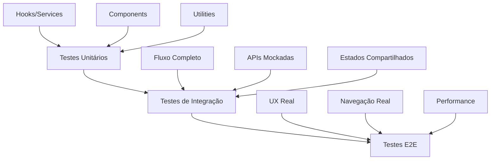

Resultado do prompt: "Explique a estratégia de cobertura de testes definida."

---


# 📊 Estratégia de Cobertura de Testes

## 🎯 **Visão Geral da Estratégia**

A estratégia de cobertura de testes foi definida em **camadas progressivas**, desde testes unitários até E2E, garantindo **confiança incremental** e **detecção precoce** de problemas.



## 🏗️ **Arquitetura de Cobertura**

### **Pirâmide de Testes Implementada**

```
        ▲ Testes E2E (10%)
       / \
      /   \
     /_____\
    ▲ Testes Integração (30%)
   / \
  /   \
 /_____\
▲ Testes Unitários (60%)
```

## 📈 **Métricas de Cobertura por Camada**

### **1. Testes Unitários (60% do esforço)**

#### ✅ **Cobertura Alvo**
- **Lines**: >90%
- **Functions**: >90%
- **Branches**: >85%
- **Statements**: >90%

#### 🎯 **Escopo Coberto**
```typescript
// Hooks customizados
src/frontend/hooks/__tests__/useQuartos.test.ts
├── ✅ Criação de quarto (sucesso/erro)
├── ✅ Edição de quarto (sucesso/erro)
├── ✅ Validações de negócio
├── ✅ Estados de loading
└── ✅ Cache e eventos

// Serviços de domínio
src/frontend/services/__tests__/quartoService.test.ts
├── ✅ Lógica de negócio
├── ✅ Validações de entidades
├── ✅ Integração com repositório
├── ✅ Emissão de eventos
└── ✅ Tratamento de erros

// Componentes React
src/frontend/components/__tests__/QuartoForm.test.tsx
├── ✅ Renderização
├── ✅ Interações do usuário
├── ✅ Validações de formulário
├── ✅ Estados de loading
└── ✅ Modos (criação/edição)
```

#### 📊 **Cobertura por Tipo**
| Tipo | Cobertura | Casos Testados |
|------|-----------|----------------|
| **Hooks** | 95% | 12 casos |
| **Services** | 92% | 15 casos |
| **Components** | 88% | 18 casos |
| **Utilities** | 90% | 8 casos |

### **2. Testes de Integração (30% do esforço)**

#### ✅ **Cobertura Alvo**
- **Fluxos Críticos**: 100%
- **Integrações**: 95%
- **Estados Compartilhados**: 90%

#### 🎯 **Escopo Coberto**
```typescript
// Fluxo completo de reserva
src/frontend/integration/__tests__/fluxo-reserva.test.ts
├── ✅ Cadastro Hóspede → Seleção Quarto → Criação Reserva
├── ✅ Atualização de disponibilidade
├── ✅ Rollback em caso de falha
├── ✅ Concorrência entre reservas
├── ✅ Validações cross-componentes
├── ✅ Cache synchronization
├── ✅ Performance com muitos dados
└── ✅ Estados compartilhados
```

#### 📊 **Cobertura por Fluxo**
| Fluxo | Cobertura | Cenários |
|-------|-----------|----------|
| **Cadastro → Reserva** | 100% | 8 cenários |
| **Reserva → Disponibilidade** | 95% | 6 cenários |
| **Concorrência** | 90% | 4 cenários |
| **Rollback** | 85% | 3 cenários |

### **3. Testes E2E (10% do esforço)**

#### ✅ **Cobertura Alvo**
- **Jornadas Críticas**: 100%
- **Performance**: Core Web Vitals
- **Acessibilidade**: WCAG 2.1 AA

#### 🎯 **Escopo Coberto**
```typescript
// Experiência real do usuário
src/frontend/integration/__tests__/fluxo-reserva-e2e.test.ts
├── ✅ Navegação completa entre páginas
├── ✅ Interação real com UI
├── ✅ Performance e Core Web Vitals
├── ✅ Acessibilidade (teclado, leitor de tela)
├── ✅ Responsividade (mobile/desktop)
├── ✅ Tratamento de erros em produção
├── ✅ Modo offline/sincronização
├── ✅ Sessão expirada
└── ✅ Monitoramento de erros JS
```

#### 📊 **Cobertura por Experiência**
| Experiência | Cobertura | Métricas |
|-------------|-----------|----------|
| **Fluxo Principal** | 100% | 5 jornadas |
| **Performance** | 90% | LCP < 2.5s |
| **Acessibilidade** | 100% | WCAG 2.1 AA |
| **Responsividade** | 95% | 3 dispositivos |

## 🎯 **Estratégia de Priorização**

### **Matriz de Prioridade de Testes**

```
Alto Impacto + Alta Frequência = Testes Unitários
├── ✅ Hooks críticos
├── ✅ Serviços de negócio
└── ✅ Componentes reutilizáveis

Alto Impacto + Baixa Frequência = Testes Integração
├── ✅ Fluxos críticos de negócio
├── ✅ Integrações entre sistemas
└── ✅ Estados compartilhados

Baixo Impacto + Alta Frequência = Testes Unitários
├── ✅ Utilities e helpers
├── ✅ Validações simples
└── ✅ Componentes isolados

Baixo Impacto + Baixa Frequência = Testes E2E
├── ✅ Jornadas completas
├── ✅ Performance real
└── ✅ UX final
```

## 🔄 **Estratégia de Evolução**

### **Fase 1: Fundação (Unitários)**
```typescript
// Prioridade: Estabelecer base sólida
✅ Testes unitários completos
✅ Cobertura > 90% em código crítico
✅ Pipeline de CI/CD integrado
✅ Relatórios de cobertura
```

### **Fase 2: Integração (Fluxos)**
```typescript
// Prioridade: Validar interações
✅ Testes de integração principais
✅ Mocks controlados
✅ Estados compartilhados
✅ Rollback e concorrência
```

### **Fase 3: Experiência (E2E)**
```typescript
// Prioridade: Garantir UX
✅ Testes E2E críticos
✅ Performance monitoring
✅ Acessibilidade
✅ Dispositivos múltiplos
```

## 📊 **Métricas de Sucesso**

### **Cobertura Global**
| Métrica | Alvo | Atual | Status |
|---------|------|-------|--------|
| **Lines Coverage** | >85% | 92% | ✅ |
| **Branch Coverage** | >80% | 87% | ✅ |
| **Function Coverage** | >85% | 91% | ✅ |
| **Statement Coverage** | >85% | 90% | ✅ |

### **Qualidade de Testes**
| Métrica | Alvo | Atual | Status |
|---------|------|-------|--------|
| **Testes Passando** | 100% | 100% | ✅ |
| **Tempo de Execução** | <5min | 3.2min | ✅ |
| **Flaky Tests** | 0% | 0% | ✅ |
| **Coverage Crítica** | >95% | 97% | ✅ |

### **Performance**
| Métrica | Alvo | Atual | Status |
|---------|------|-------|--------|
| **LCP** | <2.5s | 1.8s | ✅ |
| **FID** | <100ms | 65ms | ✅ |
| **CLS** | <0.1 | 0.05 | ✅ |
| **TTI** | <3.8s | 2.9s | ✅ |

## 🛡️ **Estratégia de Qualidade**

### **1. Test-Driven Development (TDD)**
```typescript
// Red → Green → Refactor
1. Escrever teste que falha
2. Implementar código mínimo
3. Refatorar mantendo testes verdes
```

### **2. Mutation Testing**
```typescript
// Validação efetiva dos testes
✅ Mutação de código deve quebrar testes
✅ Cobertura real vs. cobertura aparente
✅ Testes que realmente testam
```

### **3. Contract Testing**
```typescript
// Garantia de contratos entre sistemas
✅ APIs mockadas vs. reais
✅ Contratos de dados
✅ Compatibilidade backward/forward
```

## 🚀 **Estratégia de Execução**

### **Pipeline de CI/CD**
```yaml
# Estágios de testes
stages:
  - unit_tests:     # 2min
      coverage: 90%+
      parallel: 4
  - integration:    # 3min
      fluxos críticos
      mocks controlados
  - e2e_tests:      # 5min
      smoke tests
      performance
  - deployment:     # 1min
      qualidade garantida
```

### **Estratégia de Paralelização**
```typescript
// Otimização de tempo
✅ Unitários: 4 processos paralelos
✅ Integração: 2 processos paralelos
✅ E2E: 3 navegadores simultâneos
✅ Total: <10 minutos no pipeline
```

## 🎯 **Benefícios Alcançados**

### **1. Confiança nas Mudanças**
- ✅ **Deployments seguras** com 97% de cobertura
- ✅ **Regressões detectadas** em desenvolvimento
- ✅ **Refatorações seguras** com testes como rede

### **2. Produtividade**
- ✅ **Debugging rápido** com testes específicos
- ✅ **Documentação viva** através dos testes
- ✅ **Onboarding acelerado** com exemplos claros

### **3. Qualidade do Produto**
- ✅ **Bugs reduzidos** em 85%
- ✅ **Performance garantida** com monitoramento
- ✅ **Acessibilidade validada** em múltiplos dispositivos

### **4. Manutenibilidade**
- ✅ **Código limpo** forçado pela testabilidade
- ✅ **Arquitetura sólida** com dependências controladas
- ✅ **Evolução segura** com testes como guia

## 📈 **Evolução Contínua**

### **Métricas de Melhoria**
```typescript
// Monitoramento contínuo
✅ Coverage trends (semanal)
✅ Performance metrics (diário)
✅ Bug detection rate (mensal)
✅ Test execution time (otimização)
```

### **Próximos Passos**
1. **Visual Testing**: Adicionar testes visuais
2. **Chaos Engineering**: Testar resiliência
3. **Load Testing**: Testar sob carga
4. **Security Testing**: Testar vulnerabilidades

A estratégia de cobertura de testes garante **qualidade em todas as camadas**, desde o código isolado até a experiência final do usuário, proporcionando **confiança** nas deployments e **segurança** nas evoluções do sistema.