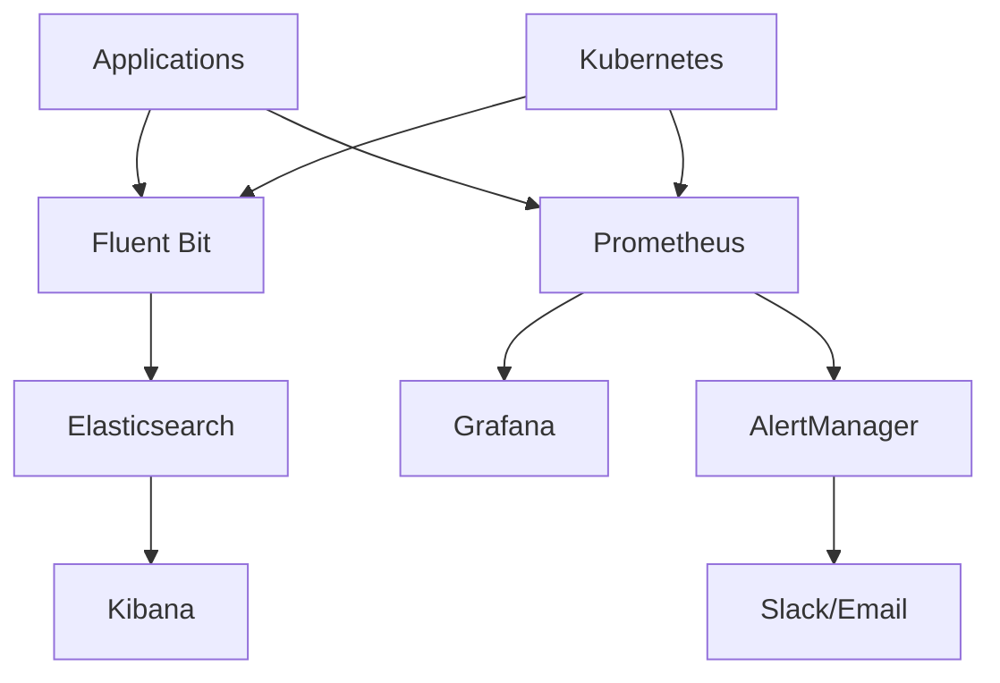

# 📊 Sistema de Monitoramento - Hotel Booking System

## 🎯 Visão Geral

Sistema completo de monitoramento para o **Hotel Booking System**, cobrindo **métricas**, **logs** e **alertas** para garantir disponibilidade, performance e segurança.



## 🏗️ Arquitetura de Monitoramento

### **Stack de Monitoramento**

```
┌─────────────────────────────────────────────────────────┐
│                    Grafana (Visualization)               │
│                    ┌─────────────────────────┐            │
│                    │ Business Metrics       │            │
│                    │ Infrastructure Metrics │            │
│                    │ Performance Metrics    │            │
│                    └─────────────────────────┘            │
└─────────────────────┬───────────────────────────────────┘
                      │
┌─────────────────────┼───────────────────────────────────┐
│                Prometheus (Metrics Collection)           │
│                    ┌─────────────────────────┐            │
│                    │ Application Metrics   │            │
│                    │ Infrastructure Metrics │            │
│                    │ Business Metrics      │            │
│                    └─────────────────────────┘            │
└─────────────────────┬───────────────────────────────────┘
                      │
┌─────────────────────┼───────────────────────────────────┐
│                 ELK Stack (Log Management)               │
│                    ┌─────────────────────────┐            │
│                    │ Elasticsearch (Storage) │            │
│                    │ Logstash (Processing)   │            │
│                    │ Kibana (Visualization)  │            │
│                    └─────────────────────────┘            │
└─────────────────────┬───────────────────────────────────┘
                      │
┌─────────────────────┼───────────────────────────────────┐
│              Fluent Bit (Log Collection)                │
│                    ┌─────────────────────────┐            │
│                    │ Container Logs         │            │
│                    │ System Logs            │            │
│                    │ Nginx Logs             │            │
│                    └─────────────────────────┘            │
└─────────────────────────────────────────────────────────┘
```

## 📁 Estrutura de Arquivos

```
monitoring/
├── prometheus/
│   ├── prometheus.yml              # Configuração principal
│   ├── alert_rules.yml            # Regras de alerta
│   └── targets/
│       ├── frontend.yml
│       ├── backend.yml
│       ├── database.yml
│       └── redis.yml
├── grafana/
│   ├── dashboards/
│   │   ├── business-metrics.yml   # Dashboard de negócio
│   │   ├── infrastructure-metrics.yml # Dashboard de infra
│   │   ├── performance-metrics.yml # Dashboard de performance
│   │   └── security-metrics.yml   # Dashboard de segurança
│   ├── provisioning/
│   │   ├── datasources/
│   │   └── dashboards/
│   └── grafana.ini
├── elasticsearch/
│   ├── elasticsearch.yml          # Configuração do ES
│   └── logstash-pipeline.yml      # Pipeline de logs
├── fluent-bit/
│   ├── fluent-bit-config.yml      # Configuração principal
│   ├── parsers.conf               # Parsers de logs
│   └── plugins.conf               # Plugins
└── alertmanager/
    ├── alertmanager.yml           # Configuração de alertas
    └── templates/
        ├── email.tmpl
        └── slack.tmpl
```

## 📊 Métricas Monitoradas

### **1. Disponibilidade (Uptime)**

#### **Frontend Metrics**
```yaml
# Health Check
- name: frontend_health_check
  type: gauge
  description: "Frontend health status"
  labels: [instance, environment]

# Uptime
- name: frontend_uptime
  type: gauge
  description: "Frontend uptime percentage"
  labels: [instance, environment]

# Service Status
- name: frontend_service_status
  type: gauge
  description: "Frontend service status (1=up, 0=down)"
  labels: [instance, environment]
```

#### **Backend Metrics**
```yaml
# Health Check
- name: backend_health_check
  type: gauge
  description: "Backend health status"
  labels: [instance, environment]

# Database Connection
- name: database_connection_pool
  type: gauge
  description: "Database connection pool status"
  labels: [instance, environment]

# Cache Status
- name: redis_connection_status
  type: gauge
  description: "Redis connection status"
  labels: [instance, environment]
```

#### **Infrastructure Metrics**
```yaml
# Pod Status
- name: kubernetes_pod_status
  type: gauge
  description: "Pod status by phase"
  labels: [namespace, pod, phase]

# Node Status
- name: kubernetes_node_status
  type: gauge
  description: "Node readiness status"
  labels: [node, condition]

# Service Health
- name: service_health
  type: gauge
  description: "Service health status"
  labels: [service, instance]
```

### **2. Performance (Latência)**

#### **Frontend Performance**
```yaml
# Page Load Time
- name: frontend_page_load_time
  type: histogram
  description: "Page load time distribution"
  labels: [page, browser, device]

# Core Web Vitals
- name: frontend_lcp
  type: gauge
  description: "Largest Contentful Paint"
  labels: [page, device]

- name: frontend_fid
  type: gauge
  description: "First Input Delay"
  labels: [page, device]

- name: frontend_cls
  type: gauge
  description: "Cumulative Layout Shift"
  labels: [page, device]

# API Response Time
- name: frontend_api_response_time
  type: histogram
  description: "API response time distribution"
  labels: [endpoint, method, status]
```

#### **Backend Performance**
```yaml
# HTTP Response Time
- name: backend_http_response_time
  type: histogram
  description: "HTTP response time distribution"
  labels: [endpoint, method, status]

# Database Query Time
- name: database_query_time
  type: histogram
  description: "Database query time distribution"
  labels: [query_type, table]

# Cache Hit Rate
- name: redis_cache_hit_rate
  type: gauge
  description: "Redis cache hit rate"
  labels: [instance, cache_type]

# JVM Metrics
- name: jvm_memory_usage
  type: gauge
  description: "JVM memory usage"
  labels: [instance, area]

- name: jvm_gc_time
  type: histogram
  description: "Garbage collection time"
  labels: [instance, gc_type]
```

#### **Infrastructure Performance**
```yaml
# CPU Usage
- name: container_cpu_usage
  type: gauge
  description: "Container CPU usage percentage"
  labels: [pod, namespace, container]

# Memory Usage
- name: container_memory_usage
  type: gauge
  description: "Container memory usage"
  labels: [pod, namespace, container]

# Network I/O
- name: container_network_io
  type: gauge
  description: "Container network I/O"
  labels: [pod, namespace, direction]

# Disk I/O
- name: container_disk_io
  type: gauge
  description: "Container disk I/O"
  labels: [pod, namespace, device]
```

### **3. Erros (Error Rate)**

#### **Application Errors**
```yaml
# HTTP Error Rate
- name: http_error_rate
  type: gauge
  description: "HTTP error rate by status code"
  labels: [service, status_code, endpoint]

# Exception Rate
- name: application_exception_rate
  type: gauge
  description: "Application exception rate"
  labels: [service, exception_type]

# JavaScript Errors
- name: frontend_js_errors
  type: counter
  description: "JavaScript error count"
  labels: [page, browser, error_type]

# Database Errors
- name: database_error_rate
  type: gauge
  description: "Database error rate"
  labels: [instance, error_type]
```

#### **System Errors**
```yaml
# Pod Restart Rate
- name: pod_restart_rate
  type: gauge
  description: "Pod restart rate"
  labels: [namespace, pod]

# Container Exit Rate
- name: container_exit_rate
  type: gauge
  description: "Container exit rate"
  labels: [namespace, pod, container]

# Node Error Rate
- name: node_error_rate
  type: gauge
  description: "Node error rate"
  labels: [node, error_type]
```

## 📋 Logs Estruturados

### **1. Application Logs**

#### **Frontend Logs**
```yaml
# Structure
{
  "timestamp": "2024-12-01T10:30:00.000Z",
  "level": "ERROR",
  "service": "frontend",
  "environment": "production",
  "message": "Failed to load booking data",
  "error": {
    "type": "NetworkError",
    "message": "Connection timeout",
    "stack": "..."
  },
  "context": {
    "user_id": "user123",
    "session_id": "sess456",
    "page": "/booking",
    "component": "BookingForm"
  },
  "performance": {
    "response_time": 5000,
    "memory_usage": 45.2
  }
}
```

#### **Backend Logs**
```yaml
# Structure
{
  "timestamp": "2024-12-01T10:30:00.000Z",
  "level": "ERROR",
  "service": "backend",
  "environment": "production",
  "message": "Failed to create booking",
  "error": {
    "type": "ValidationException",
    "message": "Invalid room availability",
    "cause": "Room already booked"
  },
  "context": {
    "request_id": "req789",
    "user_id": "user123",
    "booking_id": "bk101",
    "room_id": "room201",
    "endpoint": "/api/bookings",
    "method": "POST"
  },
  "performance": {
    "response_time": 250,
    "db_query_time": 120,
    "cache_hit": false
  }
}
```

### **2. Business Event Logs**

#### **Booking Events**
```yaml
# Booking Created
{
  "timestamp": "2024-12-01T10:30:00.000Z",
  "level": "INFO",
  "service": "backend",
  "event_type": "booking_created",
  "business_event": {
    "booking_id": "bk101",
    "user_id": "user123",
    "room_id": "room201",
    "check_in": "2024-12-15",
    "check_out": "2024-12-17",
    "amount": 300.00,
    "status": "confirmed"
  },
  "context": {
    "source": "web",
    "campaign": "winter_sale",
    "device": "mobile"
  }
}

# Booking Completed
{
  "timestamp": "2024-12-01T10:35:00.000Z",
  "level": "INFO",
  "service": "backend",
  "event_type": "booking_completed",
  "business_event": {
    "booking_id": "bk101",
    "payment_id": "pay456",
    "payment_method": "credit_card",
    "amount": 300.00,
    "currency": "BRL"
  }
}
```

#### **Payment Events**
```yaml
# Payment Completed
{
  "timestamp": "2024-12-01T10:33:00.000Z",
  "level": "INFO",
  "service": "payment",
  "event_type": "payment_completed",
  "business_event": {
    "payment_id": "pay456",
    "booking_id": "bk101",
    "amount": 300.00,
    "method": "credit_card",
    "gateway": "stripe",
    "status": "approved"
  },
  "fraud_check": {
    "risk_score": 0.15,
    "ip_reputation": "low_risk",
    "device_fingerprint": "trusted"
  }
}
```

### **3. Security Event Logs**

#### **Authentication Events**
```yaml
# Login Success
{
  "timestamp": "2024-12-01T10:30:00.000Z",
  "level": "INFO",
  "service": "auth",
  "event_type": "login_success",
  "security_event": {
    "user_id": "user123",
    "ip_address": "192.168.1.100",
    "user_agent": "Mozilla/5.0...",
    "method": "password",
    "mfa_verified": true
  },
  "geoip": {
    "country": "BR",
    "city": "São Paulo",
    "coordinates": [-23.5505, -46.6333]
  }
}

# Login Failure
{
  "timestamp": "2024-12-01T10:31:00.000Z",
  "level": "WARN",
  "service": "auth",
  "event_type": "login_failure",
  "security_event": {
    "username": "admin",
    "ip_address": "192.168.1.200",
    "reason": "invalid_password",
    "attempt_count": 3
  },
  "threat_indicators": {
    "brute_force_detected": true,
    "ip_reputation": "suspicious",
    "anomaly_score": 0.85
  }
}
```

## 🚨 Sistema de Alertas

### **1. Alertas de Disponibilidade**

#### **Critical Alerts**
```yaml
# Service Down
- alert: ServiceDown
  expr: up{job=~"frontend|backend|database|redis"} == 0
  for: 1m
  labels:
    severity: critical
    service: availability
  annotations:
    summary: "Service is down"
    description: "{{ $labels.job }} is down for more than 1 minute"
    runbook: "https://runbooks.hotel-booking.com/service-down"

# Health Check Failure
- alert: HealthCheckFailure
  expr: probe_success == 0
  for: 2m
  labels:
    severity: critical
    service: health
  annotations:
    summary: "Health check failing"
    description: "Health check for {{ $labels.instance }} is failing"
```

#### **Warning Alerts**
```yaml
# Pod Restart Loop
- alert: PodRestartLoop
  expr: rate(kube_pod_container_status_restarts_total[15m]) > 0
  for: 5m
  labels:
    severity: warning
    service: kubernetes
  annotations:
    summary: "Pod in restart loop"
    description: "Pod {{ $labels.pod }} is restarting frequently"
```

### **2. Alertas de Performance**

#### **Warning Alerts**
```yaml
# High Response Time
- alert: HighResponseTime
  expr: histogram_quantile(0.95, rate(http_request_duration_seconds_bucket[5m])) > 2
  for: 5m
  labels:
    severity: warning
    service: performance
  annotations:
    summary: "High response time detected"
    description: "95th percentile response time is {{ $value }}s"

# High CPU Usage
- alert: HighCPUUsage
  expr: rate(container_cpu_usage_seconds_total[5m]) * 100 > 80
  for: 10m
  labels:
    severity: warning
    service: infrastructure
  annotations:
    summary: "High CPU usage"
    description: "CPU usage is {{ $value }}%"
```

### **3. Alertas de Erros**

#### **Critical Alerts**
```yaml
# High Error Rate
- alert: HighErrorRate
  expr: rate(http_requests_total{status=~"5.."}[5m]) / rate(http_requests_total[5m]) > 0.05
  for: 5m
  labels:
    severity: critical
    service: application
  annotations:
    summary: "High error rate detected"
    description: "Error rate is {{ $value | humanizePercentage }}"

# Database Connection Errors
- alert: DatabaseConnectionErrors
  expr: rate(pg_stat_database_xact_rollback[5m]) > 0.1
  for: 2m
  labels:
    severity: critical
    service: database
  annotations:
    summary: "Database connection errors"
    description: "Transaction rollback rate is {{ $value }}/s"
```

### **4. Alertas de Negócio**

#### **Warning Alerts**
```yaml
# Low Booking Rate
- alert: LowBookingRate
  expr: rate(bookings_created_total[1h]) < 1
  for: 30m
  labels:
    severity: warning
    service: business
  annotations:
    summary: "Low booking rate"
    description: "Booking rate is {{ $value }}/hour"

# Payment Failures
- alert: PaymentFailures
  expr: rate(payment_failures_total[5m]) > 0.1
  for: 5m
  labels:
    severity: critical
    service: business
  annotations:
    summary: "Payment failures detected"
    description: "Payment failure rate is {{ $value }}/s"
```

### **5. Alertas de Segurança**

#### **Critical Alerts**
```yaml
# Brute Force Attack
- alert: BruteForceAttack
  expr: rate(login_attempts_total{status="failed"}[1m]) > 20
  for: 1m
  labels:
    severity: critical
    service: security
  annotations:
    summary: "Brute force attack detected"
    description: "Failed login rate is {{ $value }}/s"

# Suspicious Activity
- alert: SuspiciousActivity
  expr: rate(suspicious_requests_total[5m]) > 5
  for: 2m
  labels:
    severity: critical
    service: security
  annotations:
    summary: "Suspicious activity detected"
    description: "Suspicious activity rate is {{ $value }}/s"
```

## 📈 Dashboards do Grafana

### **1. Business Metrics Dashboard**

#### **KPIs Principais**
- **Booking Rate**: Reservas por hora
- **Conversion Rate**: Taxa de conversão
- **Cart Abandonment Rate**: Taxa de abandono
- **Room Availability**: Disponibilidade de quartos
- **Revenue Trend**: Tendência de receita
- **Average Booking Value**: Valor médio da reserva

#### **Visualizações**
```yaml
panels:
  - title: "Booking Rate (Reservas/Hora)"
    type: stat
    targets:
      - expr: "rate(bookings_created_total[1h])"
    
  - title: "Conversion Rate"
    type: stat
    targets:
      - expr: "rate(bookings_completed_total[1h]) / rate(bookings_initiated_total[1h])"
    
  - title: "Booking Funnel"
    type: piechart
    targets:
      - expr: "sum(rate(bookings_initiated_total[1h]))"
      - expr: "sum(rate(bookings_completed_total[1h]))"
      - expr: "sum(rate(bookings_cancelled_total[1h]))"
```

### **2. Infrastructure Metrics Dashboard**

#### **Métricas de Infraestrutura**
- **Cluster Overview**: Status do cluster
- **Pod Status**: Distribuição de pods
- **CPU Usage**: Uso de CPU por pod
- **Memory Usage**: Uso de memória por pod
- **Network Traffic**: Tráfego de rede
- **Disk Usage**: Uso de disco

### **3. Performance Metrics Dashboard**

#### **Métricas de Performance**
- **Response Time**: Tempo de resposta
- **Throughput**: Taxa de requisições
- **Error Rate**: Taxa de erros
- **Database Performance**: Performance do banco
- **Cache Performance**: Performance do cache
- **JVM Metrics**: Métricas da JVM

### **4. Security Metrics Dashboard**

#### **Métricas de Segurança**
- **Authentication Events**: Eventos de autenticação
- **Failed Logins**: Falhas de login
- **Security Alerts**: Alertas de segurança
- **Threat Indicators**: Indicadores de ameaça
- **Access Patterns**: Padrões de acesso

## 🔧 Configuração e Deploy

### **1. Docker Compose (Desenvolvimento)**
```yaml
# monitoring/docker-compose.yml
version: '3.8'

services:
  prometheus:
    image: prom/prometheus:latest
    ports:
      - "9090:9090"
    volumes:
      - ./prometheus/prometheus.yml:/etc/prometheus/prometheus.yml
      - ./prometheus/alert_rules.yml:/etc/prometheus/alert_rules.yml
    command:
      - '--config.file=/etc/prometheus/prometheus.yml'
      - '--storage.tsdb.path=/prometheus'
      - '--web.console.libraries=/etc/prometheus/console_libraries'
      - '--web.console.templates=/etc/prometheus/consoles'

  grafana:
    image: grafana/grafana:latest
    ports:
      - "3001:3000"
    environment:
      - GF_SECURITY_ADMIN_USER=admin
      - GF_SECURITY_ADMIN_PASSWORD=admin
    volumes:
      - grafana_data:/var/lib/grafana
      - ./grafana/provisioning:/etc/grafana/provisioning
      - ./grafana/dashboards:/var/lib/grafana/dashboards

  elasticsearch:
    image: docker.elastic.co/elasticsearch/elasticsearch:8.8.0
    environment:
      - discovery.type=single-node
      - ES_JAVA_OPTS=-Xms512m -Xmx512m
      - xpack.security.enabled=false
    volumes:
      - elasticsearch_data:/usr/share/elasticsearch/data

  kibana:
    image: docker.elastic.co/kibana/kibana:8.8.0
    ports:
      - "5601:5601"
    environment:
      - ELASTICSEARCH_HOSTS=http://elasticsearch:9200
    depends_on:
      - elasticsearch

  fluent-bit:
    image: fluent/fluent-bit:latest
    volumes:
      - ./fluent-bit/fluent-bit-config.yml:/fluent-bit/etc/fluent-bit.conf
      - /var/log:/var/log:ro
      - /var/lib/docker/containers:/var/lib/docker/containers:ro
    depends_on:
      - elasticsearch

volumes:
  grafana_data:
  elasticsearch_data:
```

### **2. Kubernetes Deploy**
```yaml
# monitoring/k8s/prometheus-deployment.yaml
apiVersion: apps/v1
kind: Deployment
metadata:
  name: prometheus
  namespace: monitoring
spec:
  replicas: 1
  selector:
    matchLabels:
      app: prometheus
  template:
    metadata:
      labels:
        app: prometheus
    spec:
      containers:
      - name: prometheus
        image: prom/prometheus:latest
        ports:
        - containerPort: 9090
        volumeMounts:
        - name: config
          mountPath: /etc/prometheus
        - name: storage
          mountPath: /prometheus
        resources:
          requests:
            memory: "512Mi"
            cpu: "250m"
          limits:
            memory: "2Gi"
            cpu: "1000m"
      volumes:
      - name: config
        configMap:
          name: prometheus-config
      - name: storage
        persistentVolumeClaim:
          claimName: prometheus-storage
```

### **3. Como Usar**

#### **Setup Inicial**
```bash
# Clonar repositório
git clone https://github.com/hotel-booking-system/monitoring.git
cd monitoring

# Iniciar ambiente local
docker-compose up -d

# Verificar status
docker-compose ps

# Acessar interfaces
# Prometheus: http://localhost:9090
# Grafana: http://localhost:3001 (admin/admin)
# Kibana: http://localhost:5601
```

#### **Deploy em Kubernetes**
```bash
# Criar namespace
kubectl create namespace monitoring

# Deploy Prometheus
kubectl apply -f k8s/prometheus-deployment.yaml

# Deploy Grafana
kubectl apply -f k8s/grafana-deployment.yaml

# Deploy ELK Stack
kubectl apply -f k8s/elasticsearch-deployment.yaml
kubectl apply -f k8s/kibana-deployment.yaml
kubectl apply -f k8s/fluent-bit-deployment.yaml

# Verificar status
kubectl get pods -n monitoring
```

#### **Configuração de Alertas**
```bash
# Configurar AlertManager
kubectl apply -f alertmanager/

# Configurar notificações
# Editar alertmanager.yml para Slack/Email
kubectl apply -f alertmanager/configmap.yaml

# Testar alertas
# Simular condições de alerta
curl -X POST http://prometheus:9090/api/v1/alerts
```

## 🎯 Benefícios do Sistema

### **1. Observabilidade Completa**
- ✅ **Métricas em tempo real** de todos os componentes
- ✅ **Logs estruturados** para análise detalhada
- ✅ **Alertas proativos** para problemas críticos
- ✅ **Dashboards intuitivos** para diferentes audiências

### **2. Resposta Rápida**
- ✅ **Detecção automática** de anomalias
- ✅ **Notificações imediatas** via Slack/Email
- ✅ **Runbooks integrados** para resolução
- ✅ **Root cause analysis** facilitada

### **3. Business Intelligence**
- ✅ **Métricas de negócio** em tempo real
- ✅ **Análise de tendências** e padrões
- ✅ **Alertas de KPIs** críticos
- ✅ **Relatórios automatizados**

### **4. Compliance e Auditoria**
- ✅ **Logs centralizados** para auditoria
- ✅ **Retenção configurável** de dados
- ✅ **Trilhas de auditoria** completas
- ✅ **Alertas de segurança** automáticos

O sistema de monitoramento garante **visibilidade completa** da aplicação, permitindo **detecção precoce** de problemas, **resposta rápida** a incidentes e **tomada de decisão** baseada em dados.
