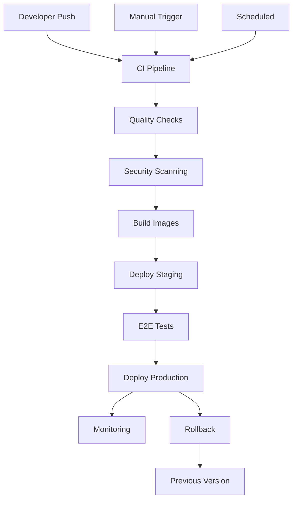
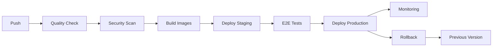
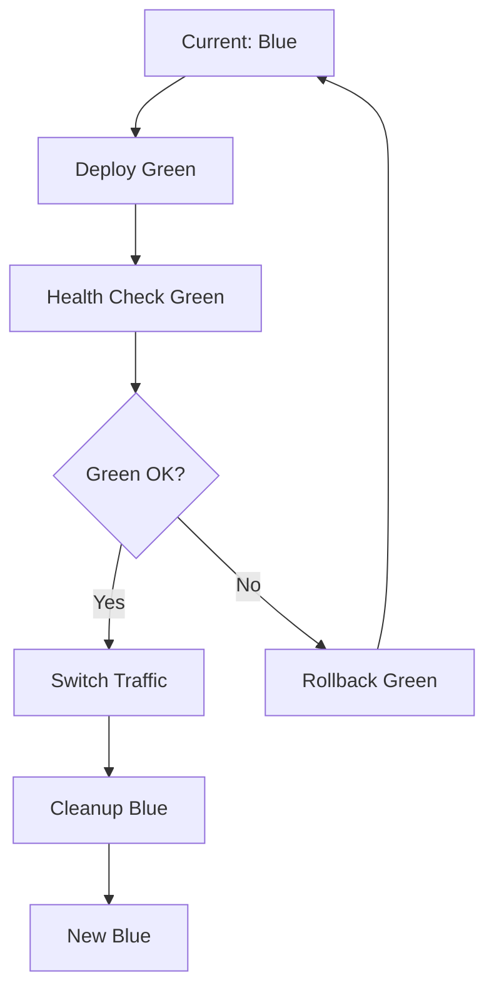
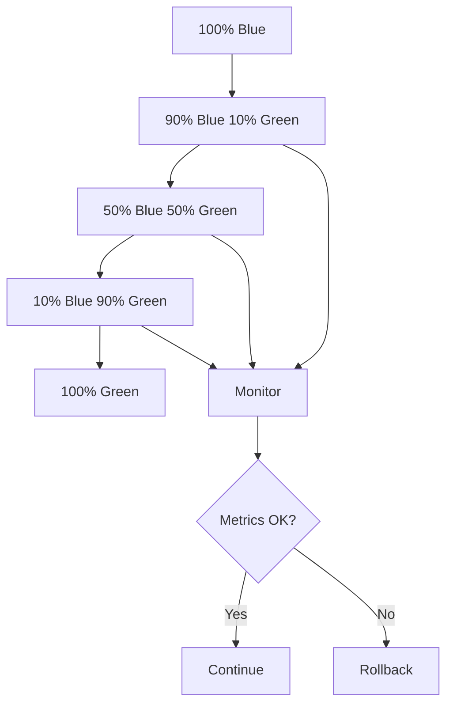
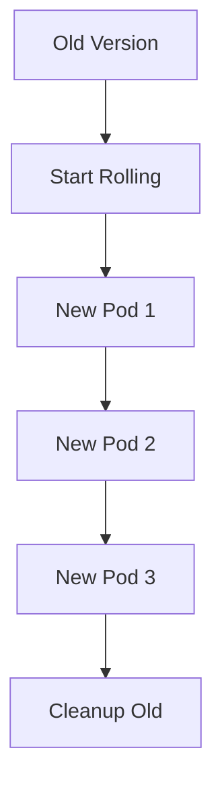

# 🚀 Pipeline de Deploy - Hotel Booking System

## 📋 Visão Geral

Pipeline completo de deploy automatizado para o **Hotel Booking System**, cobrindo desde o desenvolvimento local até produção em Kubernetes.



## 🏗️ Arquitetura de Deploy

### **Multi-Stack Architecture**
```
┌─────────────────────────────────────────────────────────┐
│                    Load Balancer                        │
│                    (Nginx + SSL)                        │
└─────────────────────┬───────────────────────────────────┘
                      │
    ┌─────────────────┼─────────────────┐
    │                 │                 │
    ▼                 ▼                 ▼
┌─────────┐    ┌─────────────┐    ┌─────────────┐
│Frontend │    │   Backend   │    │  Database   │
│React    │    │Spring Boot  │    │ PostgreSQL  │
│TypeScript│    │   Java 17   │    │   + Redis   │
└─────────┘    └─────────────┘    └─────────────┘
```

### **Ambientes de Deploy**
| Ambiente | Propósito | Infraestrutura | Deploy Strategy |
|----------|-----------|----------------|-----------------|
| **Local** | Desenvolvimento | Docker Compose | Manual |
| **Staging** | Testes/QA | Kubernetes | Blue-Green |
| **Production** | Produção | Kubernetes | Blue-Green |

## 🐳 Docker Compose (Desenvolvimento)

### **Arquivo Principal: `docker-compose.yml`**

```yaml
version: '3.8'

services:
  # Frontend - React + TypeScript
  frontend:
    build:
      context: ./src/frontend
      dockerfile: Dockerfile
      target: production
    ports:
      - "3000:3000"
    environment:
      - NODE_ENV=production
      - REACT_APP_API_URL=http://backend:8080/api
    depends_on:
      - backend
    healthcheck:
      test: ["CMD", "curl", "-f", "http://localhost:3000/health"]
      interval: 30s
      timeout: 10s
      retries: 3

  # Backend - Java + Spring Boot
  backend:
    build:
      context: ./src/main/java
      dockerfile: Dockerfile
      target: production
    ports:
      - "8080:8080"
    environment:
      - SPRING_PROFILES_ACTIVE=prod
      - SPRING_DATASOURCE_URL=jdbc:postgresql://database:5432/hotel_booking
      - SPRING_REDIS_HOST=redis
    depends_on:
      database:
        condition: service_healthy
      redis:
        condition: service_healthy
    healthcheck:
      test: ["CMD", "curl", "-f", "http://localhost:8080/actuator/health"]
      interval: 30s
      timeout: 10s
      retries: 3

  # Database - PostgreSQL
  database:
    image: postgres:15-alpine
    environment:
      - POSTGRES_DB=hotel_booking
      - POSTGRES_USER=${DB_USERNAME}
      - POSTGRES_PASSWORD=${DB_PASSWORD}
    volumes:
      - postgres_data:/var/lib/postgresql/data
    healthcheck:
      test: ["CMD-SHELL", "pg_isready -U ${DB_USERNAME} -d hotel_booking"]
      interval: 10s
      timeout: 5s
      retries: 5

  # Cache - Redis
  redis:
    image: redis:7-alpine
    command: redis-server --requirepass ${REDIS_PASSWORD} --appendonly yes
    volumes:
      - redis_data:/data
    healthcheck:
      test: ["CMD", "redis-cli", "--raw", "incr", "ping"]
      interval: 10s
      timeout: 3s
      retries: 5

  # Monitoring Stack
  prometheus:
    image: prom/prometheus:latest
    ports:
      - "9090:9090"
    volumes:
      - ./monitoring/prometheus.yml:/etc/prometheus/prometheus.yml

  grafana:
    image: grafana/grafana:latest
    ports:
      - "3001:3000"
    environment:
      - GF_SECURITY_ADMIN_USER=${GRAFANA_USER}
      - GF_SECURITY_ADMIN_PASSWORD=${GRAFANA_PASSWORD}
```

### **Como Usar**

```bash
# Iniciar ambiente completo
docker-compose up -d

# Verificar status
docker-compose ps

# Verificar logs
docker-compose logs -f frontend
docker-compose logs -f backend

# Parar ambiente
docker-compose down

# Limpar volumes
docker-compose down -v
```

## 🔄 CI/CD Pipeline (GitHub Actions)

### **Arquivo Principal: `.github/workflows/ci-cd-pipeline.yml`**

### **Estrutura do Pipeline**



### **Jobs do Pipeline**

#### **1. Quality Check & Security**
```yaml
quality-check:
  name: Code Quality & Security
  runs-on: ubuntu-latest
  
  steps:
  - name: Frontend linting
    run: npm run lint -- --format=json
    
  - name: Frontend tests with coverage
    run: npm run test:coverage
    
  - name: Backend tests
    run: mvn clean test
    
  - name: Security scanning
    run: trivy fs --format sarif
    
  - name: OWASP dependency check
    run: npm audit --audit-level high
```

#### **2. Docker Image Building**
```yaml
build-images:
  name: Build Docker Images
  strategy:
    matrix:
      service: [frontend, backend]
  
  steps:
  - name: Build and push
    uses: docker/build-push-action@v5
    with:
      context: .
      file: ./src/${{ matrix.service }}/Dockerfile
      push: true
      tags: ${{ env.REGISTRY }}/${{ env.IMAGE_NAME }}/${{ matrix.service }}
```

#### **3. Deploy to Staging**
```yaml
deploy-staging:
  name: Deploy to Staging
  environment: staging
  
  steps:
  - name: Deploy to Kubernetes
    run: |
      kubectl apply -f k8s/staging/ -n hotel-booking-staging
      kubectl rollout status deployment/frontend -n hotel-booking-staging
```

#### **4. E2E Testing**
```yaml
e2e-tests:
  name: E2E Tests
  needs: deploy-staging
  
  steps:
  - name: Run Playwright tests
    run: |
      BASE_URL=${{ needs.deploy-staging.outputs.STAGING_FRONTEND_URL }} \
      npx playwright test
```

#### **5. Deploy to Production**
```yaml
deploy-production:
  name: Deploy to Production
  environment: production
  
  steps:
  - name: Blue-Green Deployment
    run: |
      # Deploy green environment
      kubectl apply -f k8s/production/ -n hotel-booking-prod
      
      # Wait for green to be ready
      kubectl wait --for=condition=ready pod -l app=frontend-green
      
      # Switch traffic to green
      kubectl patch service frontend -p '{"spec":{"selector":{"version":"green"}}}'
      
      # Cleanup blue
      kubectl scale deployment frontend-blue --replicas=0
```

### **Triggers do Pipeline**

```yaml
on:
  push:
    branches: [ main, develop ]
  pull_request:
    branches: [ main ]
  release:
    types: [ published ]
  schedule:
    - cron: '0 2 * * *'  # Daily security scan
  workflow_dispatch:  # Manual trigger
```

## ☸️ Kubernetes Deployments

### **Frontend Deployment**

```yaml
apiVersion: apps/v1
kind: Deployment
metadata:
  name: frontend-blue
  labels:
    app: frontend
    version: blue
spec:
  replicas: 3
  strategy:
    type: RollingUpdate
    rollingUpdate:
      maxSurge: 25%
      maxUnavailable: 0
  selector:
    matchLabels:
      app: frontend
      version: blue
  template:
    spec:
      containers:
      - name: frontend
        image: ghcr.io/hotel-booking-system/frontend:latest
        ports:
        - containerPort: 3000
        env:
        - name: NODE_ENV
          value: "production"
        resources:
          requests:
            memory: "128Mi"
            cpu: "100m"
          limits:
            memory: "512Mi"
            cpu: "500m"
        livenessProbe:
          httpGet:
            path: /health
            port: 3000
          initialDelaySeconds: 30
          periodSeconds: 10
        readinessProbe:
          httpGet:
            path: /ready
            port: 3000
          initialDelaySeconds: 5
          periodSeconds: 5
```

### **Backend Deployment**

```yaml
apiVersion: apps/v1
kind: Deployment
metadata:
  name: backend-blue
  labels:
    app: backend
    version: blue
spec:
  replicas: 3
  template:
    spec:
      initContainers:
      - name: wait-for-db
        image: postgres:15-alpine
        command:
        - sh
        - -c
        - |
          until pg_isready -h database -p 5432 -U $DB_USERNAME; do
            echo "Waiting for database..."
            sleep 2
          done
      containers:
      - name: backend
        image: ghcr.io/hotel-booking-system/backend:latest
        ports:
        - containerPort: 8080
        env:
        - name: SPRING_PROFILES_ACTIVE
          value: "prod"
        - name: SPRING_DATASOURCE_URL
          value: "jdbc:postgresql://database:5432/hotel_booking"
        - name: JAVA_OPTS
          value: "-Xms512m -Xmx1024m -XX:+UseG1GC"
        resources:
          requests:
            memory: "512Mi"
            cpu: "250m"
          limits:
            memory: "2048Mi"
            cpu: "1000m"
        livenessProbe:
          httpGet:
            path: /actuator/health/liveness
            port: 8081
          initialDelaySeconds: 60
          periodSeconds: 15
        readinessProbe:
          httpGet:
            path: /actuator/health/readiness
            port: 8081
          initialDelaySeconds: 30
          periodSeconds: 10
```

### **Horizontal Pod Autoscaler**

```yaml
apiVersion: autoscaling/v2
kind: HorizontalPodAutoscaler
metadata:
  name: frontend-hpa
spec:
  scaleTargetRef:
    apiVersion: apps/v1
    kind: Deployment
    name: frontend-blue
  minReplicas: 3
  maxReplicas: 10
  metrics:
  - type: Resource
    resource:
      name: cpu
      target:
        type: Utilization
        averageUtilization: 70
  - type: Resource
    resource:
      name: memory
      target:
        type: Utilization
        averageUtilization: 80
```

## 🔄 Estratégias de Deploy

### **1. Blue-Green Deployment**



**Vantagens:**
- ✅ Zero downtime
- ✅ Rollback instantâneo
- ✅ Testes em ambiente real
- ✅ Redução de risco

**Implementação:**
```bash
# Deploy green environment
kubectl apply -f k8s/production/green/

# Wait for green to be ready
kubectl wait --for=condition=ready pod -l app=frontend-green

# Switch traffic
kubectl patch service frontend -p '{"spec":{"selector":{"version":"green"}}}'

# Cleanup blue
kubectl scale deployment frontend-blue --replicas=0
```

### **2. Canary Deployment**



**Vantagens:**
- ✅ Risco mínimo
- ✅ Testes graduais
- ✅ Monitoramento contínuo
- ✅ Rollback granular

### **3. Rolling Update**



**Vantagens:**
- ✅ Simples implementação
- ✅ Recursos otimizados
- ✅ Gradual e controlado

## 📊 Monitoramento e Observabilidade

### **Stack de Monitoramento**

```yaml
# Prometheus - Metrics Collection
prometheus:
  image: prom/prometheus:latest
  ports:
    - "9090:9090"
  volumes:
    - ./monitoring/prometheus.yml:/etc/prometheus/prometheus.yml

# Grafana - Visualization
grafana:
  image: grafana/grafana:latest
  ports:
    - "3001:3000"
  environment:
    - GF_SECURITY_ADMIN_USER=${GRAFANA_USER}
    - GF_SECURITY_ADMIN_PASSWORD=${GRAFANA_PASSWORD}

# ELK Stack - Logging
elasticsearch:
  image: docker.elastic.co/elasticsearch/elasticsearch:8.8.0
  environment:
    - discovery.type=single-node
    - ES_JAVA_OPTS=-Xms512m -Xmx512m

kibana:
  image: docker.elastic.co/kibana/kibana:8.8.0
  ports:
    - "5601:5601"
```

### **Métricas Monitoradas**

#### **Frontend Metrics**
- **Performance**: LCP, FID, CLS
- **User Experience**: Page Load, Error Rate
- **Business Metrics**: Conversion Rate, Booking Funnel

#### **Backend Metrics**
- **Application**: Response Time, Throughput, Error Rate
- **JVM**: Heap Usage, GC Time, Thread Count
- **Database**: Connection Pool, Query Time
- **Cache**: Hit Rate, Memory Usage

#### **Infrastructure Metrics**
- **Kubernetes**: Pod Status, Resource Usage
- **Network**: Latency, Throughput
- **Storage**: Disk Usage, I/O Operations

### **Alertas Configurados**

```yaml
# Prometheus Alert Rules
groups:
- name: hotel-booking-alerts
  rules:
  - alert: HighErrorRate
    expr: rate(http_requests_total{status=~"5.."}[5m]) > 0.1
    for: 5m
    labels:
      severity: critical
    annotations:
      summary: "High error rate detected"
      description: "Error rate is {{ $value }} errors per second"

  - alert: HighResponseTime
    expr: histogram_quantile(0.95, rate(http_request_duration_seconds_bucket[5m])) > 2
    for: 5m
    labels:
      severity: warning
    annotations:
      summary: "High response time detected"
      description: "95th percentile response time is {{ $value }} seconds"

  - alert: PodCrashLooping
    expr: rate(kube_pod_container_status_restarts_total[15m]) > 0
    for: 5m
    labels:
      severity: critical
    annotations:
      summary: "Pod is crash looping"
      description: "Pod {{ $labels.pod }} is restarting frequently"
```

## 🔒 Segurança no Deploy

### **1. Image Security**
```yaml
# Trivy scanning
- name: Run Trivy vulnerability scanner
  uses: aquasecurity/trivy-action@master
  with:
    image-ref: ${{ env.REGISTRY }}/${{ env.IMAGE_NAME }}/frontend:latest
    format: 'sarif'
    output: 'trivy-results.sarif'

# SBOM generation
- name: Generate SBOM
  uses: anchore/sbom-action@v0
  with:
    image: ${{ env.REGISTRY }}/${{ env.IMAGE_NAME }}/frontend:latest
    format: spdx-json
```

### **2. Kubernetes Security**
```yaml
# Security Context
securityContext:
  runAsNonRoot: true
  runAsUser: 1001
  fsGroup: 1001
  capabilities:
    drop:
    - ALL

# Network Policy
apiVersion: networking.k8s.io/v1
kind: NetworkPolicy
metadata:
  name: frontend-netpol
spec:
  podSelector:
    matchLabels:
      app: frontend
  policyTypes:
  - Ingress
  - Egress
  ingress:
  - from:
    - namespaceSelector:
        matchLabels:
          name: ingress-nginx
    ports:
    - protocol: TCP
      port: 3000
```

### **3. Secrets Management**
```yaml
# Kubernetes Secrets
apiVersion: v1
kind: Secret
metadata:
  name: app-secrets
type: Opaque
data:
  DB_PASSWORD: <base64-encoded>
  API_KEY: <base64-encoded>

# External Secrets Operator
apiVersion: external-secrets.io/v1beta1
kind: SecretStore
metadata:
  name: vault-backend
spec:
  provider:
    vault:
      server: "https://vault.example.com"
      path: "secret"
      version: "v2"
      auth:
        kubernetes:
          mountPath: "kubernetes"
          role: "hotel-booking"
```

## 🚀 Performance e Escalabilidade

### **1. Horizontal Scaling**
```yaml
# HPA Configuration
apiVersion: autoscaling/v2
kind: HorizontalPodAutoscaler
metadata:
  name: frontend-hpa
spec:
  scaleTargetRef:
    apiVersion: apps/v1
    kind: Deployment
    name: frontend-blue
  minReplicas: 3
  maxReplicas: 10
  metrics:
  - type: Resource
    resource:
      name: cpu
      target:
        type: Utilization
        averageUtilization: 70
  - type: Resource
    resource:
      name: memory
      target:
        type: Utilization
        averageUtilization: 80
```

### **2. Vertical Scaling**
```yaml
# VPA Configuration
apiVersion: autoscaling.k8s.io/v1
kind: VerticalPodAutoscaler
metadata:
  name: frontend-vpa
spec:
  targetRef:
    apiVersion: apps/v1
    kind: Deployment
    name: frontend-blue
  updatePolicy:
    updateMode: "Auto"
  resourcePolicy:
    containerPolicies:
    - containerName: frontend
      maxAllowed:
        cpu: 1
        memory: 2Gi
      minAllowed:
        cpu: 100m
        memory: 128Mi
```

### **3. Cluster Autoscaler**
```yaml
# Cluster Autoscaler Configuration
apiVersion: apps/v1
kind: Deployment
metadata:
  name: cluster-autoscaler
spec:
  template:
    spec:
      containers:
      - image: k8s.gcr.io/autoscaling/cluster-autoscaler:v1.21.0
        command:
        - ./cluster-autoscaler
        - --v=4
        - --stderrthreshold=info
        - --cloud-provider=aws
        - --skip-nodes-with-local-storage=false
        - --expander=least-waste
        - --node-group-auto-discovery=asg:tag=k8s.io/cluster-autoscaler/enabled,k8s.io/cluster-autoscaler/hotel-booking
```

## 🔄 Backup e Recovery

### **1. Database Backup**
```yaml
# CronJob for Database Backup
apiVersion: batch/v1
kind: CronJob
metadata:
  name: database-backup
spec:
  schedule: "0 2 * * *"  # Daily at 2 AM
  jobTemplate:
    spec:
      template:
        spec:
          containers:
          - name: postgres-backup
            image: postgres:15-alpine
            command:
            - sh
            - -c
            - |
              pg_dump -h $DB_HOST -U $DB_USERNAME -d hotel_booking | \
              gzip > /backup/backup-$(date +%Y%m%d-%H%M%S).sql.gz
              aws s3 cp /backup/backup-$(date +%Y%m%d-%H%M%S).sql.gz \
                s3://hotel-booking-backups/database/
            env:
            - name: DB_HOST
              value: database
            - name: DB_USERNAME
              valueFrom:
                secretKeyRef:
                  name: database-secrets
                  key: username
            - name: PGPASSWORD
              valueFrom:
                secretKeyRef:
                  name: database-secrets
                  key: password
            volumeMounts:
            - name: backup-storage
              mountPath: /backup
          volumes:
          - name: backup-storage
            emptyDir: {}
          restartPolicy: OnFailure
```

### **2. Disaster Recovery**
```bash
#!/bin/bash
# Disaster Recovery Script

# 1. Restore Database
kubectl exec -i deployment/database -- psql -U $DB_USERNAME -d hotel_booking < backup.sql

# 2. Restore Application State
kubectl apply -f k8s/production/
kubectl rollout status deployment/frontend
kubectl rollout status deployment/backend

# 3. Verify Health
curl -f http://frontend/health
curl -f http://backend/actuator/health

# 4. Update Monitoring
kubectl apply -f monitoring/
```

## 📈 Como Usar o Pipeline

### **1. Setup Inicial**
```bash
# Clonar repositório
git clone https://github.com/hotel-booking-system.git
cd hotel-booking-system

# Configurar secrets no GitHub
# - GITHUB_TOKEN
# - DB_USERNAME, DB_PASSWORD
# - REDIS_PASSWORD
# - SENTRY_DSN
# - KUBE_CONFIG_PRODUCTION
# - SLACK_WEBHOOK

# Setup local environment
cp .env.example .env
# Editar .env com variáveis locais

# Iniciar ambiente local
docker-compose up -d
```

### **2. Deploy Automático**
```bash
# Push para develop → Deploy Staging
git push origin develop

# Push para main → Deploy Production
git push origin main

# Release → Deploy Production com tag
git tag v1.0.0
git push origin v1.0.0
```

### **3. Deploy Manual**
```bash
# Trigger manual via GitHub Actions
# ou via CLI:
gh workflow run ci-cd-pipeline.yml --field environment=staging

# Deploy via kubectl
kubectl apply -f k8s/production/
kubectl rollout status deployment/frontend
```

### **4. Monitoramento**
```bash
# Verificar status dos deployments
kubectl get pods -n hotel-booking-prod
kubectl get services -n hotel-booking-prod

# Verificar logs
kubectl logs -f deployment/frontend -n hotel-booking-prod
kubectl logs -f deployment/backend -n hotel-booking-prod

# Acessar dashboards
# Grafana: http://localhost:3001
# Prometheus: http://localhost:9090
# Kibana: http://localhost:5601
```

### **5. Troubleshooting**
```bash
# Verificar eventos
kubectl get events -n hotel-booking-prod --sort-by='.lastTimestamp'

# Debug pod
kubectl describe pod <pod-name> -n hotel-booking-prod
kubectl exec -it <pod-name> -n hotel-booking-prod -- sh

# Rollback
kubectl rollout undo deployment/frontend -n hotel-booking-prod
kubectl rollout undo deployment/backend -n hotel-booking-prod

# Scale
kubectl scale deployment frontend --replicas=5 -n hotel-booking-prod
```

## 🎯 Benefícios do Pipeline

### **1. Automação Completa**
- ✅ **Zero-touch deployments** - Push to deploy
- ✅ **Quality gates** - Testes automatizados
- ✅ **Security scanning** - Vulnerability detection
- ✅ **Rollback automático** - Recuperação rápida

### **2. Confiabilidade**
- ✅ **Blue-Green strategy** - Zero downtime
- ✅ **Health checks** - Monitoramento contínuo
- ✅ **Gradual rollout** - Risco minimizado
- ✅ **Backup automático** - Proteção de dados

### **3. Performance**
- ✅ **Horizontal scaling** - Auto-scaling
- ✅ **Resource optimization** - CPU/Memory limits
- ✅ **Load balancing** - Distribuição de carga
- ✅ **Caching strategy** - Redis integration

### **4. Observabilidade**
- ✅ **Metrics collection** - Prometheus + Grafana
- ✅ **Log aggregation** - ELK Stack
- ✅ **Distributed tracing** - Request tracking
- ✅ **Alerting** - Proactive monitoring

O pipeline de deploy garante entregas **rápidas, seguras e confiáveis**, com monitoramento completo e capacidade de recuperação automática, proporcionando **confiança** nas deployments e **estabilidade** em produção.
