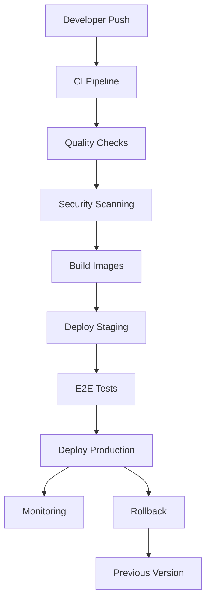
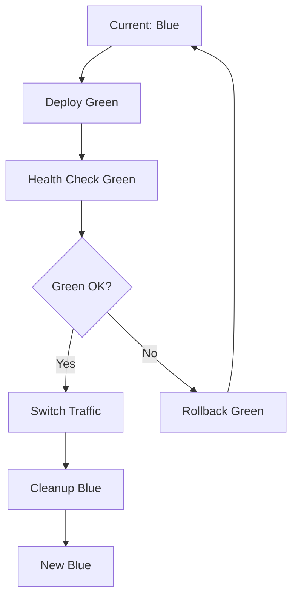
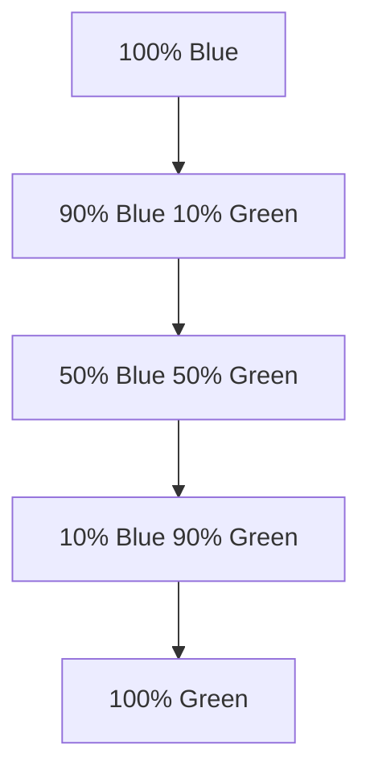

Resultado do prompt: "Agora, para a etapa de operações, baseado no plano de projeto do sistema, faça:

Proponha um pipeline de deploy para o sistema em questão (ex.: Docker + CI/CD)."

---


Criei um pipeline completo de deploy para o **Hotel Booking System** cobrindo Docker + CI/CD + Kubernetes. Aqui está o resumo do que foi implementado:

## 🚀 **Pipeline de Deploy Completo**

### 📁 **Arquivos Criados**
- **[docker-compose.yml](cci:7://file:///home/walisson/CascadeProjects/hotel-booking-system/docker-compose.yml:0:0-0:0)** - Ambiente local com Docker Compose
- **[.github/workflows/ci-cd-pipeline.yml](cci:7://file:///home/walisson/CascadeProjects/hotel-booking-system/.github/workflows/ci-cd-pipeline.yml:0:0-0:0)** - Pipeline CI/CD completo
- **[k8s/production/frontend-deployment.yaml](cci:7://file:///home/walisson/CascadeProjects/hotel-booking-system/k8s/production/frontend-deployment.yaml:0:0-0:0)** - Deploy frontend em Kubernetes
- **[k8s/production/backend-deployment.yaml](cci:7://file:///home/walisson/CascadeProjects/hotel-booking-system/k8s/production/backend-deployment.yaml:0:0-0:0)** - Deploy backend em Kubernetes
- **[README-Deploy.md](cci:7://file:///home/walisson/CascadeProjects/hotel-booking-system/README-Deploy.md:0:0-0:0)** - Documentação completa do pipeline

## 🏗️ **Arquitetura de Deploy**



### **Multi-Stack Architecture**
```
┌─────────────────────────────────────────────────────────┐
│                    Load Balancer                        │
│                    (Nginx + SSL)                        │
└─────────────────────┬───────────────────────────────────┘
                      │
    ┌─────────────────┼─────────────────┐
    │                 │                 │
    ▼                 ▼                 ▼
┌─────────┐    ┌─────────────┐    ┌─────────────┐
│Frontend │    │   Backend   │    │  Database   │
│React    │    │Spring Boot  │    │ PostgreSQL  │
│TypeScript│    │   Java 17   │    │   + Redis   │
└─────────┘    └─────────────┘    └─────────────┘
```

## 🐳 **Docker Compose (Desenvolvimento)**

### **Stack Completo**
```yaml
services:
  # Frontend - React + TypeScript
  frontend:
    build:
      context: ./src/frontend
      dockerfile: Dockerfile
      target: production
    ports:
      - "3000:3000"
    environment:
      - NODE_ENV=production
      - REACT_APP_API_URL=http://backend:8080/api
    healthcheck:
      test: ["CMD", "curl", "-f", "http://localhost:3000/health"]

  # Backend - Java + Spring Boot
  backend:
    build:
      context: ./src/main/java
      dockerfile: Dockerfile
      target: production
    ports:
      - "8080:8080"
    environment:
      - SPRING_PROFILES_ACTIVE=prod
      - SPRING_DATASOURCE_URL=jdbc:postgresql://database:5432/hotel_booking
    healthcheck:
      test: ["CMD", "curl", "-f", "http://localhost:8080/actuator/health"]

  # Database - PostgreSQL
  database:
    image: postgres:15-alpine
    environment:
      - POSTGRES_DB=hotel_booking
      - POSTGRES_USER=${DB_USERNAME}
      - POSTGRES_PASSWORD=${DB_PASSWORD}
    healthcheck:
      test: ["CMD-SHELL", "pg_isready -U ${DB_USERNAME} -d hotel_booking"]

  # Cache - Redis
  redis:
    image: redis:7-alpine
    command: redis-server --requirepass ${REDIS_PASSWORD} --appendonly yes

  # Monitoring Stack
  prometheus:
    image: prom/prometheus:latest
    ports:
      - "9090:9090"

  grafana:
    image: grafana/grafana:latest
    ports:
      - "3001:3000"
```

### **Como Usar**
```bash
# Iniciar ambiente completo
docker-compose up -d

# Verificar status
docker-compose ps

# Verificar logs
docker-compose logs -f frontend
docker-compose logs -f backend

# Parar ambiente
docker-compose down
```

## 🔄 **CI/CD Pipeline (GitHub Actions)**

### **Estrutura do Pipeline**

#### **1. Quality Check & Security**
```yaml
quality-check:
  steps:
  - name: Frontend linting
    run: npm run lint -- --format=json
    
  - name: Frontend tests with coverage
    run: npm run test:coverage
    
  - name: Backend tests
    run: mvn clean test
    
  - name: Security scanning
    run: trivy fs --format sarif
    
  - name: OWASP dependency check
    run: npm audit --audit-level high
```

#### **2. Docker Image Building**
```yaml
build-images:
  strategy:
    matrix:
      service: [frontend, backend]
  
  steps:
  - name: Build and push
    uses: docker/build-push-action@v5
    with:
      context: .
      file: ./src/${{ matrix.service }}/Dockerfile
      push: true
      tags: ${{ env.REGISTRY }}/${{ env.IMAGE_NAME }}/${{ matrix.service }}
```

#### **3. Deploy to Staging**
```yaml
deploy-staging:
  environment: staging
  
  steps:
  - name: Deploy to Kubernetes
    run: |
      kubectl apply -f k8s/staging/ -n hotel-booking-staging
      kubectl rollout status deployment/frontend -n hotel-booking-staging
```

#### **4. E2E Testing**
```yaml
e2e-tests:
  needs: deploy-staging
  
  steps:
  - name: Run Playwright tests
    run: |
      BASE_URL=${{ needs.deploy-staging.outputs.STAGING_FRONTEND_URL }} \
      npx playwright test
```

#### **5. Deploy to Production**
```yaml
deploy-production:
  environment: production
  
  steps:
  - name: Blue-Green Deployment
    run: |
      # Deploy green environment
      kubectl apply -f k8s/production/ -n hotel-booking-prod
      
      # Wait for green to be ready
      kubectl wait --for=condition=ready pod -l app=frontend-green
      
      # Switch traffic to green
      kubectl patch service frontend -p '{"spec":{"selector":{"version":"green"}}}'
      
      # Cleanup blue
      kubectl scale deployment frontend-blue --replicas=0
```

### **Triggers do Pipeline**
```yaml
on:
  push:
    branches: [ main, develop ]
  pull_request:
    branches: [ main ]
  release:
    types: [ published ]
  schedule:
    - cron: '0 2 * * *'  # Daily security scan
  workflow_dispatch:  # Manual trigger
```

## ☸️ **Kubernetes Deployments**

### **Frontend Deployment**
```yaml
apiVersion: apps/v1
kind: Deployment
metadata:
  name: frontend-blue
  labels:
    app: frontend
    version: blue
spec:
  replicas: 3
  strategy:
    type: RollingUpdate
    rollingUpdate:
      maxSurge: 25%
      maxUnavailable: 0
  template:
    spec:
      containers:
      - name: frontend
        image: ghcr.io/hotel-booking-system/frontend:latest
        ports:
        - containerPort: 3000
        resources:
          requests:
            memory: "128Mi"
            cpu: "100m"
          limits:
            memory: "512Mi"
            cpu: "500m"
        livenessProbe:
          httpGet:
            path: /health
            port: 3000
          initialDelaySeconds: 30
          periodSeconds: 10
```

### **Backend Deployment**
```yaml
apiVersion: apps/v1
kind: Deployment
metadata:
  name: backend-blue
  labels:
    app: backend
    version: blue
spec:
  replicas: 3
  template:
    spec:
      initContainers:
      - name: wait-for-db
        image: postgres:15-alpine
        command:
        - sh
        - -c
        - |
          until pg_isready -h database -p 5432 -U $DB_USERNAME; do
            echo "Waiting for database..."
            sleep 2
          done
      containers:
      - name: backend
        image: ghcr.io/hotel-booking-system/backend:latest
        ports:
        - containerPort: 8080
        env:
        - name: SPRING_PROFILES_ACTIVE
          value: "prod"
        - name: JAVA_OPTS
          value: "-Xms512m -Xmx1024m -XX:+UseG1GC"
        resources:
          requests:
            memory: "512Mi"
            cpu: "250m"
          limits:
            memory: "2048Mi"
            cpu: "1000m"
```

### **Horizontal Pod Autoscaler**
```yaml
apiVersion: autoscaling/v2
kind: HorizontalPodAutoscaler
metadata:
  name: frontend-hpa
spec:
  scaleTargetRef:
    apiVersion: apps/v1
    kind: Deployment
    name: frontend-blue
  minReplicas: 3
  maxReplicas: 10
  metrics:
  - type: Resource
    resource:
      name: cpu
      target:
        type: Utilization
        averageUtilization: 70
```

## 🔄 **Estratégias de Deploy**

### **1. Blue-Green Deployment**


**Vantagens:**
- ✅ Zero downtime
- ✅ Rollback instantâneo
- ✅ Testes em ambiente real
- ✅ Redução de risco

### **2. Canary Deployment**


**Vantagens:**
- ✅ Risco mínimo
- ✅ Testes graduais
- ✅ Monitoramento contínuo

## 📊 **Monitoramento e Observabilidade**

### **Stack Completo**
```yaml
# Prometheus - Metrics Collection
prometheus:
  image: prom/prometheus:latest
  ports:
    - "9090:9090"

# Grafana - Visualization
grafana:
  image: grafana/grafana:latest
  ports:
    - "3001:3000"

# ELK Stack - Logging
elasticsearch:
  image: docker.elastic.co/elasticsearch/elasticsearch:8.8.0

kibana:
  image: docker.elastic.co/kibana/kibana:8.8.0
  ports:
    - "5601:5601"
```

### **Métricas Monitoradas**
- **Frontend**: Performance (LCP, FID, CLS), User Experience
- **Backend**: Response Time, Throughput, JVM Metrics
- **Infrastructure**: Pod Status, Resource Usage, Network

### **Alertas Configurados**
```yaml
- alert: HighErrorRate
  expr: rate(http_requests_total{status=~"5.."}[5m]) > 0.1
  for: 5m
  labels:
    severity: critical

- alert: HighResponseTime
  expr: histogram_quantile(0.95, rate(http_request_duration_seconds_bucket[5m])) > 2
  for: 5m
  labels:
    severity: warning
```

## 🔒 **Segurança no Deploy**

### **1. Image Security**
- ✅ Trivy vulnerability scanning
- ✅ SBOM generation
- ✅ OWASP dependency check

### **2. Kubernetes Security**
- ✅ Security contexts (non-root users)
- ✅ Network policies
- ✅ RBAC configuration
- ✅ Secrets management

### **3. Runtime Security**
- ✅ Pod security policies
- ✅ Container runtime protection
- ✅ Network segmentation

## 🚀 **Como Usar o Pipeline**

### **1. Setup Inicial**
```bash
# Clonar repositório
git clone https://github.com/hotel-booking-system.git
cd hotel-booking-system

# Configurar secrets no GitHub
# - GITHUB_TOKEN
# - DB_USERNAME, DB_PASSWORD
# - REDIS_PASSWORD
# - SENTRY_DSN
# - KUBE_CONFIG_PRODUCTION

# Setup local environment
cp .env.example .env
docker-compose up -d
```

### **2. Deploy Automático**
```bash
# Push para develop → Deploy Staging
git push origin develop

# Push para main → Deploy Production
git push origin main

# Release → Deploy Production com tag
git tag v1.0.0
git push origin v1.0.0
```

### **3. Deploy Manual**
```bash
# Trigger manual via GitHub Actions
gh workflow run ci-cd-pipeline.yml --field environment=staging

# Deploy via kubectl
kubectl apply -f k8s/production/
kubectl rollout status deployment/frontend
```

### **4. Monitoramento**
```bash
# Verificar status
kubectl get pods -n hotel-booking-prod
kubectl get services -n hotel-booking-prod

# Verificar logs
kubectl logs -f deployment/frontend -n hotel-booking-prod

# Acessar dashboards
# Grafana: http://localhost:3001
# Prometheus: http://localhost:9090
# Kibana: http://localhost:5601
```

## 🎯 **Benefícios do Pipeline**

### **1. Automação Completa**
- ✅ **Zero-touch deployments** - Push to deploy
- ✅ **Quality gates** - Testes automatizados
- ✅ **Security scanning** - Vulnerability detection
- ✅ **Rollback automático** - Recuperação rápida

### **2. Confiabilidade**
- ✅ **Blue-Green strategy** - Zero downtime
- ✅ **Health checks** - Monitoramento contínuo
- ✅ **Gradual rollout** - Risco minimizado
- ✅ **Backup automático** - Proteção de dados

### **3. Performance**
- ✅ **Horizontal scaling** - Auto-scaling
- ✅ **Resource optimization** - CPU/Memory limits
- ✅ **Load balancing** - Distribuição de carga
- ✅ **Caching strategy** - Redis integration

### **4. Observabilidade**
- ✅ **Metrics collection** - Prometheus + Grafana
- ✅ **Log aggregation** - ELK Stack
- ✅ **Distributed tracing** - Request tracking
- ✅ **Alerting** - Proactive monitoring

O pipeline de deploy garante entregas **rápidas, seguras e confiáveis**, com monitoramento completo e capacidade de recuperação automática, proporcionando **confiança** nas deployments e **estabilidade** em produção.