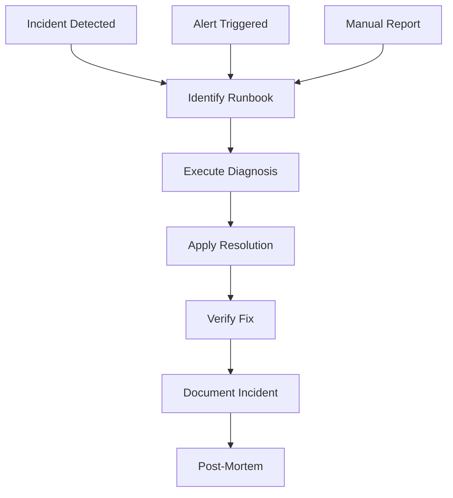

# 📚 Runbooks - Hotel Booking System

## 🎯 Visão Geral

**Runbooks** são procedimentos detalhados para responder a falhas e incidentes no **Hotel Booking System**. Cada runbook inclui diagnóstico, resolução e verificação pós-incidente.



## 📋 Estrutura dos Runbooks

### **Formato Padrão**
```yaml
runbook:
  id: "RUNBOOK-001"
  title: "Service Down Response"
  severity: "critical"
  category: "availability"
  
  # Informações Gerais
  overview: "Procedimento para responder a falhas de serviço"
  owner: "SRE Team"
  contact: ["sre@hotel-booking.com", "+55-11-9999-9999"]
  
  # Condições de Gatilho
  triggers:
    - alert: "ServiceDown"
    - alert: "HealthCheckFailure"
    - manual: "User reports service unavailable"
  
  # Pré-requisitos
  prerequisites:
    tools: ["kubectl", "docker", "curl", "ssh"]
    access: ["cluster-admin", "service-accounts"]
    knowledge: ["Kubernetes", "Docker", "Application Architecture"]
  
  # Procedimento
  procedure:
    diagnosis: [...]
    resolution: [...]
    verification: [...]
    escalation: [...]
  
  # Pós-Incidente
  post_incident:
    documentation: [...]
    monitoring: [...]
    prevention: [...]
```

## 🚨 Runbooks Críticos

### **RUNBOOK-001: Service Down Response**

#### **Visão Geral**
```yaml
runbook:
  id: "RUNBOOK-001"
  title: "Service Down Response"
  severity: "critical"
  category: "availability"
  estimated_time: "15-30 minutos"
  
overview: |
  Responder a falhas completas de serviço (frontend, backend, database, cache).
  Este runbook cobre diagnóstico rápido, recuperação de serviço e verificação de funcionalidade.
```

#### **Gatilhos**
```yaml
triggers:
  alerts:
    - name: "FrontendDown"
      condition: "up{job=\"frontend\"} == 0"
    - name: "BackendDown"
      condition: "up{job=\"backend\"} == 0"
    - name: "DatabaseDown"
      condition: "up{job=\"database\"} == 0"
    - name: "RedisDown"
      condition: "up{job=\"redis\"} == 0"
  
  manual:
    - "User reports 503 errors"
    - "Load balancer shows unhealthy instances"
    - "Health check failures in monitoring"
```

#### **Diagnóstico**
```bash
# 1. Verificar Status dos Serviços
echo "=== Verificando Status dos Serviços ==="
kubectl get pods -n hotel-booking-prod
kubectl get services -n hotel-booking-prod
kubectl get deployments -n hotel-booking-prod

# 2. Verificar Health Checks
echo "=== Verificando Health Checks ==="
kubectl get endpoints -n hotel-booking-prod
kubectl describe pod -l app=frontend -n hotel-booking-prod
kubectl describe pod -l app=backend -n hotel-booking-prod

# 3. Verificar Logs Recentes
echo "=== Verificando Logs Recentes ==="
kubectl logs -l app=frontend -n hotel-booking-prod --tail=100
kubectl logs -l app=backend -n hotel-booking-prod --tail=100

# 4. Verificar Recursos
echo "=== Verificando Recursos ==="
kubectl top pods -n hotel-booking-prod
kubectl describe nodes

# 5. Verificar Conectividade
echo "=== Verificando Conectividade ==="
kubectl exec -it deployment/frontend -n hotel-booking-prod -- curl -f http://backend:8080/health
kubectl exec -it deployment/backend -n hotel-booking-prod -- curl -f http://database:5432
```

#### **Resolução**
```bash
# 1. Restart Pods com Problemas
echo "=== Reiniciando Pods com Problemas ==="
kubectl rollout restart deployment/frontend -n hotel-booking-prod
kubectl rollout restart deployment/backend -n hotel-booking-prod

# 2. Escalar Serviços se Necessário
echo "=== Escalando Serviços ==="
kubectl scale deployment frontend --replicas=5 -n hotel-booking-prod
kubectl scale deployment backend --replicas=5 -n hotel-booking-prod

# 3. Verificar ConfigMaps e Secrets
echo "=== Verificando Configurações ==="
kubectl get configmaps -n hotel-booking-prod
kubectl get secrets -n hotel-booking-prod

# 4. Reaplicar Configurações se Corrompidas
echo "=== Reaplicando Configurações ==="
kubectl apply -f k8s/production/ -n hotel-booking-prod

# 5. Verificar Network Policies
echo "=== Verificando Network Policies ==="
kubectl get networkpolicies -n hotel-booking-prod
kubectl describe networkpolicy frontend-netpol -n hotel-booking-prod
```

#### **Verificação**
```bash
# 1. Verificar Status dos Deployments
echo "=== Verificando Deployments ==="
kubectl rollout status deployment/frontend -n hotel-booking-prod
kubectl rollout status deployment/backend -n hotel-booking-prod

# 2. Testar Endpoints
echo "=== Testando Endpoints ==="
kubectl exec -it deployment/frontend -n hotel-booking-prod -- curl -f http://localhost:3000/health
kubectl exec -it deployment/backend -n hotel-booking-prod -- curl -f http://localhost:8080/actuator/health

# 3. Verificar Conectividade Externa
echo "=== Testando Conectividade Externa ==="
curl -f https://hotel-booking.com/health
curl -f https://api.hotel-booking.com/health

# 4. Verificar Monitoramento
echo "=== Verificando Monitoramento ==="
curl -f http://prometheus:9090/api/v1/query?query=up
```

#### **Escalonamento**
```yaml
escalation:
  level_1:
    trigger: "Não resolvido em 15 minutos"
    contact: ["sre-lead@hotel-booking.com"]
    action: "Engenharia SRE sênior"
    
  level_2:
    trigger: "Não resolvido em 30 minutos"
    contact: ["engineering-manager@hotel-booking.com"]
    action: "Gerência de Engenharia"
    
  level_3:
    trigger: "Impacto em produção > 50%"
    contact: ["cto@hotel-booking.com"]
    action: "Comitê de Crise"
```

---

### **RUNBOOK-002: High Error Rate Response**

#### **Visão Geral**
```yaml
runbook:
  id: "RUNBOOK-002"
  title: "High Error Rate Response"
  severity: "critical"
  category: "performance"
  estimated_time: "20-45 minutos"
  
overview: |
  Responder a picos de taxa de erros (4xx, 5xx) em frontend ou backend.
  Inclui análise de causas, mitigação imediata e correção de raiz.
```

#### **Gatilhos**
```yaml
triggers:
  alerts:
    - name: "FrontendHighErrorRate"
      condition: "rate(http_requests_total{job=\"frontend\",status=~\"5..\"}[5m]) / rate(http_requests_total{job=\"frontend\"}[5m]) > 0.05"
    - name: "BackendHighErrorRate"
      condition: "rate(http_requests_total{job=\"backend\",status=~\"5..\"}[5m]) / rate(http_requests_total{job=\"backend\"}[5m]) > 0.02"
    - name: "High4xxErrorRate"
      condition: "rate(http_requests_total{status=~\"4..\"}[5m]) / rate(http_requests_total[5m]) > 0.1"
```

#### **Diagnóstico**
```bash
# 1. Analisar Taxa de Erros
echo "=== Analisando Taxa de Erros ==="
curl -s "http://prometheus:9090/api/v1/query?query=rate(http_requests_total{status=~\"5..\"}[5m])" | jq '.data.result'

# 2. Identificar Endpoints com Problemas
echo "=== Identificando Endpoints Problemáticos ==="
curl -s "http://prometheus:9090/api/v1/query?query=topk(10, rate(http_requests_total{status=~\"5..\"}[5m]) by (endpoint))" | jq '.data.result'

# 3. Analisar Logs de Erro
echo "=== Analisando Logs de Erro ==="
kubectl logs -l app=backend -n hotel-booking-prod --since=10m | grep -i error
kubectl logs -l app=frontend -n hotel-booking-prod --since=10m | grep -i error

# 4. Verificar Recursos dos Pods
echo "=== Verificando Recursos ==="
kubectl top pods -n hotel-booking-prod --sort-by=cpu
kubectl top pods -n hotel-booking-prod --sort-by=memory

# 5. Analisar Performance do Database
echo "=== Analisando Database ==="
kubectl exec -it deployment/database -n hotel-booking-prod -- psql -U postgres -d hotel_booking -c "SELECT state, count(*) FROM pg_stat_activity GROUP BY state;"
kubectl exec -it deployment/database -n hotel-booking-prod -- psql -U postgres -d hotel_booking -c "SELECT query, calls, total_time, mean_time FROM pg_stat_statements ORDER BY total_time DESC LIMIT 10;"
```

#### **Resolução**
```bash
# 1. Escalar Serviços Afetados
echo "=== Escalando Serviços ==="
kubectl scale deployment frontend --replicas=10 -n hotel-booking-prod
kubectl scale deployment backend --replicas=10 -n hotel-booking-prod

# 2. Reiniciar Pods com Erros
echo "=== Reiniciando Pods ==="
kubectl rollout restart deployment/backend -n hotel-booking-prod
kubectl rollout restart deployment/frontend -n hotel-booking-prod

# 3. Ajustar Resource Limits
echo "=== Ajustando Resources ==="
kubectl patch deployment backend -p '{"spec":{"template":{"spec":{"containers":[{"name":"backend","resources":{"limits":{"memory":"4Gi","cpu":"2000m"}}}]}}}}' -n hotel-booking-prod

# 4. Otimizar Database
echo "=== Otimizando Database ==="
kubectl exec -it deployment/database -n hotel-booking-prod -- psql -U postgres -d hotel_booking -c "VACUUM ANALYZE;"
kubectl exec -it deployment/database -n hotel-booking-prod -- psql -U postgres -d hotel_booking -c "SELECT pg_stat_reset();"

# 5. Limpar Cache se Corrompido
echo "=== Limpando Cache ==="
kubectl exec -it deployment/redis -n hotel-booking-prod -- redis-cli FLUSHALL
kubectl rollout restart deployment/redis -n hotel-booking-prod
```

#### **Verificação**
```bash
# 1. Monitorar Taxa de Erros
echo "=== Monitorando Taxa de Erros ==="
watch -n 30 'curl -s "http://prometheus:9090/api/v1/query?query=rate(http_requests_total{status=~\"5..\"}[5m])" | jq ".data.result[0].value[1]"'

# 2. Testar Funcionalidade
echo "=== Testando Funcionalidade ==="
curl -X POST https://api.hotel-booking.com/api/bookings -H "Content-Type: application/json" -d '{"room_id": "room101", "check_in": "2024-12-15", "check_out": "2024-12-17"}'

# 3. Verificar Performance
echo "=== Verificando Performance ==="
curl -w "@curl-format.txt" -o /dev/null -s https://hotel-booking.com/
curl -w "@curl-format.txt" -o /dev/null -s https://api.hotel-booking.com/health
```

---

### **RUNBOOK-003: Database Performance Issues**

#### **Visão Geral**
```yaml
runbook:
  id: "RUNBOOK-003"
  title: "Database Performance Issues"
  severity: "critical"
  category: "database"
  estimated_time: "30-60 minutos"
  
overview: |
  Resolver problemas de performance do PostgreSQL (queries lentas, locks, conexões).
  Inclui diagnóstico de queries, otimização e recuperação de serviço.
```

#### **Gatilhos**
```yaml
triggers:
  alerts:
    - name: "DatabaseSlowQueries"
      condition: "pg_stat_activity_max_duration_seconds > 5"
    - name: "DatabaseConnectionErrors"
      condition: "rate(pg_stat_database_xact_rollback[5m]) > 0.1"
    - name: "HighDatabaseConnections"
      condition: "pg_stat_database_numbackends > 80"
```

#### **Diagnóstico**
```bash
# 1. Verificar Conexões Ativas
echo "=== Verificando Conexões ==="
kubectl exec -it deployment/database -n hotel-booking-prod -- psql -U postgres -d hotel_booking -c "SELECT state, count(*) FROM pg_stat_activity GROUP BY state;"

# 2. Identificar Queries Lentas
echo "=== Queries Lentas ==="
kubectl exec -it deployment/database -n hotel-booking-prod -- psql -U postgres -d hotel_booking -c "SELECT query, calls, total_time, mean_time FROM pg_stat_statements ORDER BY mean_time DESC LIMIT 10;"

# 3. Verificar Locks
echo "=== Verificando Locks ==="
kubectl exec -it deployment/database -n hotel-booking-prod -- psql -U postgres -d hotel_booking -c "SELECT blocked_locks.pid AS blocked_pid, blocked_activity.usename AS blocked_user, blocking_locks.pid AS blocking_pid, blocking_activity.usename AS blocking_user, blocked_activity.query AS blocked_statement, blocking_activity.query AS current_statement_in_blocking_process FROM pg_catalog.pg_locks blocked_locks JOIN pg_catalog.pg_stat_activity blocked_activity ON blocked_activity.pid = blocked_locks.pid JOIN pg_catalog.pg_locks blocking_locks ON blocking_locks.locktype = blocked_locks.locktype JOIN pg_catalog.pg_stat_activity blocking_activity ON blocking_activity.pid = blocking_locks.pid WHERE NOT blocked_locks.granted;"

# 4. Analisar Índices
echo "=== Analisando Índices ==="
kubectl exec -it deployment/database -n hotel-booking-prod -- psql -U postgres -d hotel_booking -c "SELECT schemaname, tablename, attname, n_distinct, correlation FROM pg_stats WHERE tablename IN ('bookings', 'rooms', 'users') ORDER BY tablename, attname;"

# 5. Verificar Espaço em Disco
echo "=== Verificando Espaço ==="
kubectl exec -it deployment/database -n hotel-booking-prod -- df -h
kubectl exec -it deployment/database -n hotel-booking-prod -- psql -U postgres -d hotel_booking -c "SELECT pg_size_pretty(pg_database_size('hotel_booking'));"
```

#### **Resolução**
```bash
# 1. Matar Queries Problemáticas
echo "=== Matando Queries Problemáticas ==="
kubectl exec -it deployment/database -n hotel-booking-prod -- psql -U postgres -d hotel_booking -c "SELECT pg_terminate_backend(pid) FROM pg_stat_activity WHERE state = 'active' AND query_start < now() - interval '5 minutes';"

# 2. Otimizar Tabelas
echo "=== Otimizando Tabelas ==="
kubectl exec -it deployment/database -n hotel-booking-prod -- psql -U postgres -d hotel_booking -c "VACUUM ANALYZE bookings;"
kubectl exec -it deployment/database -n hotel-booking-prod -- psql -U postgres -d hotel_booking -c "VACUUM ANALYZE rooms;"
kubectl exec -it deployment/database -n hotel-booking-prod -- psql -U postgres -d hotel_booking -c "VACUUM ANALYZE users;"

# 3. Recriar Índices se Necessário
echo "=== Recriando Índices ==="
kubectl exec -it deployment/database -n hotel-booking-prod -- psql -U postgres -d hotel_booking -c "REINDEX DATABASE hotel_booking;"

# 4. Ajustar Configurações
echo "=== Ajustando Configurações ==="
kubectl exec -it deployment/database -n hotel-booking-prod -- psql -U postgres -d hotel_booking -c "ALTER SYSTEM SET shared_buffers = '256MB';"
kubectl exec -it deployment/database -n hotel-booking-prod -- psql -U postgres -d hotel_booking -c "ALTER SYSTEM SET effective_cache_size = '1GB';"
kubectl exec -it deployment/database -n hotel-booking-prod -- pg_ctl reload

# 5. Escalar Database se Necessário
echo "=== Escalando Database ==="
kubectl patch statefulset database -p '{"spec":{"replicas":2}}' -n hotel-booking-prod
```

#### **Verificação**
```bash
# 1. Verificar Performance das Queries
echo "=== Verificando Performance ==="
kubectl exec -it deployment/database -n hotel-booking-prod -- psql -U postgres -d hotel_booking -c "SELECT query, calls, total_time, mean_time FROM pg_stat_statements ORDER BY mean_time DESC LIMIT 5;"

# 2. Testar Conectividade
echo "=== Testando Conectividade ==="
kubectl exec -it deployment/backend -n hotel-booking-prod -- curl -f http://database:5432

# 3. Verificar Taxa de Erros
echo "=== Verificando Taxa de Erros ==="
curl -s "http://prometheus:9090/api/v1/query?query=rate(pg_stat_database_xact_rollback[5m])" | jq '.data.result'
```

---

### **RUNBOOK-004: Security Incident Response**

#### **Visão Geral**
```yaml
runbook:
  id: "RUNBOOK-004"
  title: "Security Incident Response"
  severity: "critical"
  category: "security"
  estimated_time: "45-90 minutos"
  
overview: |
  Responder a incidentes de segurança (brute force, SQL injection, acesso não autorizado).
  Inclui contenção, investigação e recuperação.
```

#### **Gatilhos**
```yaml
triggers:
  alerts:
    - name: "BruteForceAttack"
      condition: "rate(login_attempts_total{status=\"failed\"}[1m]) > 20"
    - name: "SuspiciousActivity"
      condition: "rate(suspicious_requests_total[5m]) > 5"
    - name: "SQLInjectionAttempt"
      condition: "increase(sql_injection_attempts_total[5m]) > 0"
```

#### **Diagnóstico**
```bash
# 1. Analisar Logs de Segurança
echo "=== Analisando Logs de Segurança ==="
kubectl logs -l app=backend -n hotel-booking-prod --since=15m | grep -i "security\|attack\|injection"
kubectl logs -l app=nginx -n hotel-booking-prod --since=15m | grep -i "error\|forbidden"

# 2. Identificar IPs Suspeitos
echo "=== Identificando IPs Suspeitos ==="
kubectl logs -l app=backend -n hotel-booking-prod --since=1h | grep "login_failure" | awk '{print $1}' | sort | uniq -c | sort -nr | head -10

# 3. Verificar Acessos Recentes
echo "=== Verificando Acessos Recentes ==="
kubectl exec -it deployment/backend -n hotel-booking-prod -- grep "login_success" /var/log/application.log | tail -20

# 4. Analisar Tráfego Anômalo
echo "=== Analisando Tráfego Anômalo ==="
curl -s "http://prometheus:9090/api/v1/query?query=rate(http_requests_total[5m])" | jq '.data.result'

# 5. Verificar Alterações de Configuração
echo "=== Verificando Alterações ==="
kubectl get configmaps -n hotel-booking-prod -o yaml | diff - /tmp/configmaps-backup.yaml
kubectl get secrets -n hotel-booking-prod -o yaml | diff - /tmp/secrets-backup.yaml
```

#### **Resolução**
```bash
# 1. Bloquear IPs Maliciosos
echo "=== Bloqueando IPs ==="
kubectl annotate namespace hotel-booking-prod "net.beta.kubernetes.io/network-policy=block-ips"
kubectl apply -f - <<EOF
apiVersion: networking.k8s.io/v1
kind: NetworkPolicy
metadata:
  name: block-malicious-ips
  namespace: hotel-booking-prod
spec:
  podSelector: {}
  policyTypes:
  - Ingress
  ingress:
  - from:
    - ipBlock:
        cidr: 192.168.1.0/24
        except:
        - 192.168.1.100/32
EOF

# 2. Revogar Tokens Suspeitos
echo "=== Revogando Tokens ==="
kubectl exec -it deployment/backend -n hotel-booking-prod -- curl -X POST http://localhost:8080/api/admin/revoke-suspicious-tokens

# 3. Forçar Logout de Usuários Suspeitos
echo "=== Forçando Logout ==="
kubectl exec -it deployment/backend -n hotel-booking-prod -- curl -X POST http://localhost:8080/api/admin/force-logout -d '{"user_ids": ["user123", "user456"]}'

# 4. Ativar Rate Limiting
echo "=== Ativando Rate Limiting ==="
kubectl patch ingress hotel-booking -p '{"metadata":{"annotations":{"nginx.ingress.kubernetes.io/rate-limit":"100"}}}' -n hotel-booking-prod

# 5. Escalar Serviços de Segurança
echo "=== Escalando Segurança ==="
kubectl scale deployment backend --replicas=10 -n hotel-booking-prod
kubectl scale deployment frontend --replicas=10 -n hotel-booking-prod
```

#### **Verificação**
```bash
# 1. Verificar se IPs estão Bloqueados
echo "=== Verificando Bloqueio ==="
kubectl exec -it deployment/nginx -n hotel-booking-prod -- curl -I http://192.168.1.200/health

# 2. Monitorar Tentativas de Ataque
echo "=== Monitorando Ataques ==="
watch -n 10 'kubectl logs -l app=backend -n hotel-booking-prod --tail=5 | grep -i "attack\|injection"'

# 3. Verificar Taxa de Erros
echo "=== Verificando Taxa de Erros ==="
curl -s "http://prometheus:9090/api/v1/query?query=rate(login_attempts_total{status=\"failed\"}[1m])" | jq '.data.result'
```

---

### **RUNBOOK-005: Resource Exhaustion**

#### **Visão Geral**
```yaml
runbook:
  id: "RUNBOOK-005"
  title: "Resource Exhaustion"
  severity: "critical"
  category: "infrastructure"
  estimated_time: "20-40 minutos"
  
overview: |
  Resolver esgotamento de recursos (CPU, memory, disk, network).
  Inclui diagnóstico, otimização e escalamento.
```

#### **Gatilhos**
```yaml
triggers:
  alerts:
    - name: "HighCPUUsage"
      condition: "rate(container_cpu_usage_seconds_total[5m]) * 100 > 80"
    - name: "HighMemoryUsage"
      condition: "(container_memory_usage_bytes / container_spec_memory_limit_bytes) * 100 > 85"
    - name: "DiskSpaceLow"
      condition: "(node_filesystem_avail_bytes / node_filesystem_size_bytes) * 100 < 10"
```

#### **Diagnóstico**
```bash
# 1. Verificar Uso de Recursos
echo "=== Verificando Recursos ==="
kubectl top nodes
kubectl top pods -n hotel-booking-prod --sort-by=cpu
kubectl top pods -n hotel-booking-prod --sort-by=memory

# 2. Analisar Consumo por Pod
echo "=== Consumo por Pod ==="
kubectl exec -it deployment/frontend -n hotel-booking-prod -- top
kubectl exec -it deployment/backend -n hotel-booking-prod -- top

# 3. Verificar Espaço em Disco
echo "=== Verificando Disco ==="
kubectl exec -it deployment/database -n hotel-booking-prod -- df -h
kubectl exec -it deployment/backend -n hotel-booking-prod -- df -h

# 4. Analisar Network I/O
echo "=== Verificando Network ==="
kubectl exec -it deployment/frontend -n hotel-booking-prod -- ifstat
kubectl exec -it deployment/backend -n hotel-booking-prod -- ifstat

# 5. Verificar Limits e Requests
echo "=== Verificando Limits ==="
kubectl describe deployment frontend -n hotel-booking-prod | grep -A 10 "Resources:"
kubectl describe deployment backend -n hotel-booking-prod | grep -A 10 "Resources:"
```

#### **Resolução**
```bash
# 1. Escalar Pods com Alta Carga
echo "=== Escalando Pods ==="
kubectl scale deployment frontend --replicas=10 -n hotel-booking-prod
kubectl scale deployment backend --replicas=10 -n hotel-booking-prod

# 2. Aumentar Resource Limits
echo "=== Aumentando Limits ==="
kubectl patch deployment backend -p '{"spec":{"template":{"spec":{"containers":[{"name":"backend","resources":{"limits":{"memory":"4Gi","cpu":"2000m"},"requests":{"memory":"2Gi","cpu":"1000m"}}}]}}}}' -n hotel-booking-prod

# 3. Limpar Logs Antigos
echo "=== Limpando Logs ==="
kubectl exec -it deployment/backend -n hotel-booking-prod -- find /var/log -name "*.log" -mtime +7 -delete
kubectl exec -it deployment/database -n hotel-booking-prod -- find /var/log/postgresql -name "*.log" -mtime +7 -delete

# 4. Otimizar Imagens Docker
echo "=== Otimizando Imagens ==="
kubectl patch deployment frontend -p '{"spec":{"template":{"spec":{"containers":[{"name":"frontend","image":"hotel-booking/frontend:optimized"}]}}}}' -n hotel-booking-prod

# 5. Adicionar Nodes ao Cluster
echo "=== Adicionando Nodes ==="
kubectl scale statefulset database --replicas=2 -n hotel-booking-prod
```

#### **Verificação**
```bash
# 1. Monitorar Uso de Recursos
echo "=== Monitorando Recursos ==="
watch -n 30 'kubectl top pods -n hotel-booking-prod'

# 2. Verificar Performance
echo "=== Verificando Performance ==="
curl -w "@curl-format.txt" -o /dev/null -s https://hotel-booking.com/

# 3. Verificar Disponibilidade
echo "=== Verificando Disponibilidade ==="
kubectl get pods -n hotel-booking-prod
kubectl get services -n hotel-booking-prod
```

---

## 📋 Procedimentos Gerais

### **1. Comunicação de Incidentes**

#### **Notificação Inicial**
```yaml
incident_communication:
  initial_notification:
    channels: ["slack#incidents", "email:sre-team@hotel-booking.com"]
    template: |
      🚨 **INCIDENTE CRÍTICO** 🚨
      
      **Runbook:** {runbook_title}
      **Severidade:** {severity}
      **Início:** {timestamp}
      **Impacto:** {impact_description}
      
      **Ações em Andamento:**
      - {action_1}
      - {action_2}
      
      **Próxima Atualização:** {next_update_time}
      
      **Comandante do Incidente:** {incident_commander}
```

#### **Atualizações de Status**
```yaml
status_updates:
  frequency: "15 minutos"
  channels: ["slack#incidents", "email:stakeholders@hotel-booking.com"]
  
  templates:
    investigating: |
      🔍 **Investigando** - {runbook_title}
      
      **Status:** Investigação em andamento
      **Tempo decorrido:** {elapsed_time}
      **Descobertas:** {findings}
      
    identified: |
      🎯 **Causa Identificada** - {runbook_title}
      
      **Causa Raiz:** {root_cause}
      **Impacto:** {impact}
      **ETA para Resolução:** {eta}
      
    resolved: |
      ✅ **Resolvido** - {runbook_title}
      
      **Resumo:** {resolution_summary}
      **Duração:** {duration}
      **Ações Pós-Incidente:** {post_actions}
```

### **2. Escalonamento**

#### **Níveis de Escalonamento**
```yaml
escalation_levels:
  level_1:
    trigger: "15 minutos sem resolução"
    team: "SRE Team"
    contact: ["sre-lead@hotel-booking.com", "+55-11-9999-9999"]
    
  level_2:
    trigger: "30 minutos sem resolução"
    team: "Engineering Management"
    contact: ["eng-manager@hotel-booking.com", "+55-11-8888-8888"]
    
  level_3:
    trigger: "Impacto crítico em negócio"
    team: "Executive Team"
    contact: ["cto@hotel-booking.com", "+55-11-7777-7777"]
    
  level_4:
    trigger: "Disaster recovery necessário"
    team: "Crisis Management"
    contact: ["ceo@hotel-booking.com", "+55-11-6666-6666"]
```

### **3. Pós-Incidente**

#### **Análise de Causa Raiz (RCA)**
```yaml
root_cause_analysis:
  timeline:
    - "00:00 - Incidente detectado"
    - "00:05 - Runbook iniciado"
    - "00:15 - Causa identificada"
    - "00:30 - Resolução aplicada"
    - "00:45 - Serviço restaurado"
    
  contributing_factors:
    - "Configuração incorreta de resource limits"
    - "Monitoramento insuficiente"
    - "Falta de testes de carga"
    
  immediate_actions:
    - "Ajustar resource limits"
    - "Adicionar alertas proativos"
    - "Implementar testes automatizados"
    
  long_term_prevention:
    - "Implementar auto-scaling"
    - "Melhorar monitoramento"
    - "Revisar arquitetura"
```

#### **Documentação**
```yaml
documentation:
  incident_report:
    title: "Relatório de Incidente - {date}"
    sections:
      - "Resumo Executivo"
      - "Linha do Tempo"
      - "Análise de Impacto"
      - "Causa Raiz"
      - "Ações Tomadas"
      - "Lições Aprendidas"
      - "Ações Preventivas"
      
  knowledge_base:
    articles:
      - "Como diagnosticar problemas de performance"
      - "Procedimentos de escalamento automático"
      - "Melhores práticas de configuração"
```

### **4. Automação**

#### **Scripts Automáticos**
```bash
#!/bin/bash
# auto-incident-response.sh
# Script automatizado para resposta inicial a incidentes

# Variáveis
INCIDENT_TYPE=$1
SEVERITY=$2
NAMESPACE="hotel-booking-prod"

# Função de notificação
notify() {
    local message=$1
    curl -X POST -H 'Content-type: application/json' \
        --data "{\"text\":\"$message\"}" \
        https://hooks.slack.com/services/YOUR/SLACK/WEBHOOK
}

# Função de diagnóstico rápido
quick_diagnosis() {
    echo "=== Diagnóstico Rápido ==="
    kubectl get pods -n $NAMESPACE
    kubectl top pods -n $NAMESPACE
    kubectl get events -n $NAMESPACE --sort-by='.lastTimestamp'
}

# Função de recuperação básica
basic_recovery() {
    echo "=== Recuperação Básica ==="
    kubectl rollout restart deployment/frontend -n $NAMESPACE
    kubectl rollout restart deployment/backend -n $NAMESPACE
    kubectl scale deployment frontend --replicas=5 -n $NAMESPACE
    kubectl scale deployment backend --replicas=5 -n $NAMESPACE
}

# Execução principal
case $INCIDENT_TYPE in
    "service_down")
        notify "🚨 Service Down Incident Detected"
        quick_diagnosis
        basic_recovery
        ;;
    "high_error_rate")
        notify "📊 High Error Rate Incident Detected"
        quick_diagnosis
        kubectl scale deployment frontend --replicas=10 -n $NAMESPACE
        kubectl scale deployment backend --replicas=10 -n $NAMESPACE
        ;;
    "resource_exhaustion")
        notify "💾 Resource Exhaustion Incident Detected"
        quick_diagnosis
        kubectl patch deployment backend -p '{"spec":{"template":{"spec":{"containers":[{"name":"backend","resources":{"limits":{"memory":"4Gi","cpu":"2000m"}}}]}}}}' -n $NAMESPACE
        ;;
    *)
        echo "Unknown incident type: $INCIDENT_TYPE"
        exit 1
        ;;
esac

notify "✅ Initial response completed for $INCIDENT_TYPE"
```

## 🎯 Melhoria Contínua

### **1. Revisão de Runbooks**
```yaml
runbook_review:
  frequency: "trimestral"
  participants: ["SRE Team", "Engineering Team", "Product Team"]
  
  review_criteria:
    - "Precisão dos procedimentos"
    - "Completude das etapas"
    - "Clareza das instruções"
    - "Efetividade das soluções"
    
  improvement_actions:
    - "Atualizar comandos obsoletos"
    - "Adicionar novos cenários"
    - "Melhorar documentação"
    - "Automatizar procedimentos"
```

### **2. Treinamento**
```yaml
training_program:
  frequency: "mensal"
  participants: ["SRE Team", "Engineering Team"]
  
  scenarios:
    - "Simulação de service down"
    - "Ataque de segurança simulado"
    - "Esgotamento de recursos"
    - "Falha em cascade"
    
  evaluation:
    - "Tempo de resposta"
    - "Precisão do diagnóstico"
    - "Efetividade da resolução"
    - "Comunicação durante incidente"
```

### **3. Métricas de Eficácia**
```yaml
effectiveness_metrics:
  response_time:
    target: "15 minutos para diagnóstico inicial"
    measurement: "time_to_diagnosis"
    
  resolution_time:
    target: "60 minutos para resolução"
    measurement: "time_to_resolution"
    
  incident_frequency:
    target: "Redução de 20% ao trimestre"
    measurement: "incident_rate"
    
  customer_impact:
    target: "< 5% de usuários afetados"
    measurement: "user_impact_percentage"
```

Os runbooks garantem **resposta padronizada** e **eficiente** a incidentes, reduzindo **tempo de recuperação** e **impacto no negócio**, com melhoria contínua baseada em **métricas** e **feedback** da equipe.
