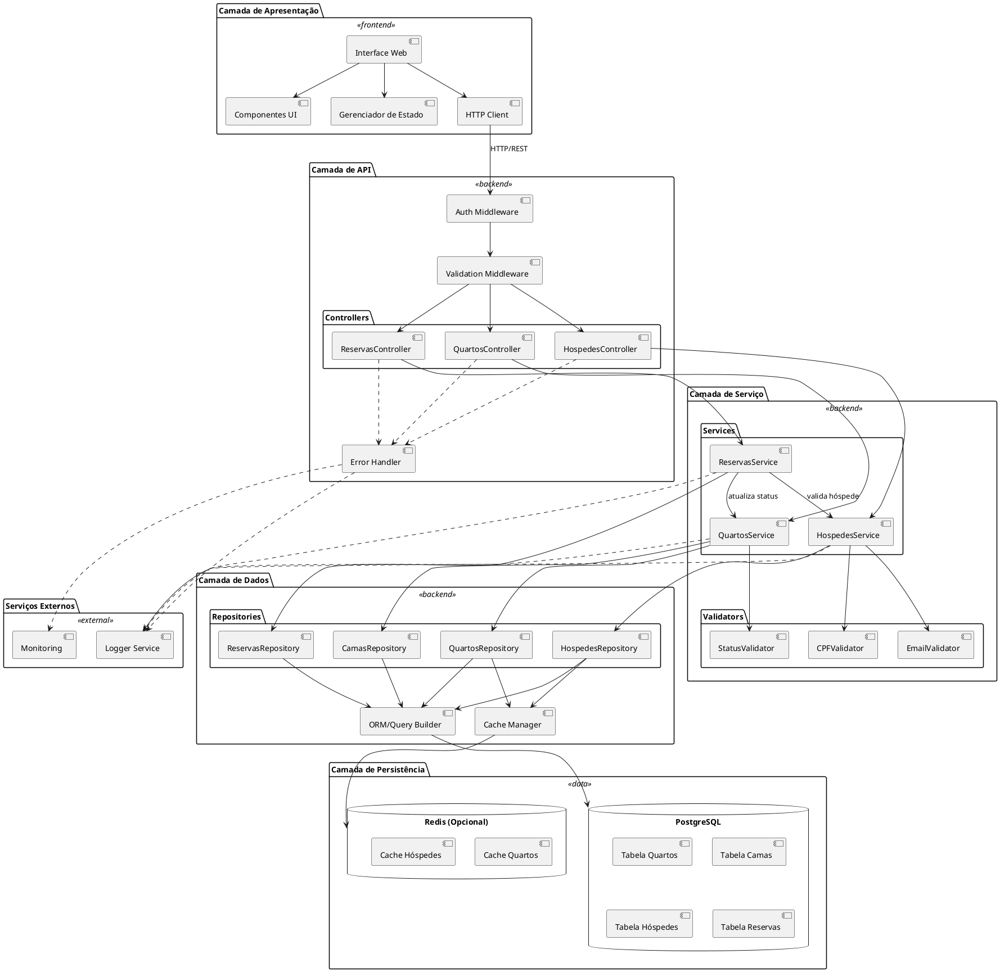

# Diagrama de Componentes - Sistema de Reserva Hoteleira

## 1. Diagrama UML de Componentes (PlantUML)



## 2. Diagrama de Componentes Detalhado (Texto ASCII)
```
┌─────────────────────────────────────────────────────────────────────────┐
│                        CAMADA DE APRESENTAÇÃO                            │
│  ┌──────────────┐  ┌──────────────┐  ┌──────────────┐  ┌─────────────┐ │
│  │ Interface Web│  │ Componentes  │  │  State Mgmt  │  │ HTTP Client │ │
│  │   (React/    │◄─┤   UI (MUI/   │◄─┤  (Redux/     │◄─┤   (Axios)   │ │
│  │    Vue.js)   │  │   Vuetify)   │  │   Pinia)     │  │             │ │
│  └──────────────┘  └──────────────┘  └──────────────┘  └──────┬──────┘ │
└────────────────────────────────────────────────────────────────┼────────┘
                                                                  │
                                                    HTTP/REST API │
                                                                  ▼
┌─────────────────────────────────────────────────────────────────────────┐
│                           CAMADA DE API                                  │
│  ┌──────────────────────────────────────────────────────────────────┐   │
│  │                      Middleware Chain                             │   │
│  │  ┌──────────────┐  ┌──────────────┐  ┌──────────────────────┐   │   │
│  │  │     Auth     │→ │  Validation  │→ │   Error Handler      │   │   │
│  │  │  Middleware  │  │  Middleware  │  │   (Centralizado)     │   │   │
│  │  └──────────────┘  └──────────────┘  └──────────────────────┘   │   │
│  └──────────────────────────────────────────────────────────────────┘   │
│                                                                          │
│  ┌──────────────────────────────────────────────────────────────────┐   │
│  │                         Controllers                               │   │
│  │  ┌──────────────┐  ┌──────────────┐  ┌──────────────────────┐   │   │
│  │  │   Quartos    │  │  Hóspedes    │  │      Reservas        │   │   │
│  │  │  Controller  │  │  Controller  │  │     Controller       │   │   │
│  │  │              │  │              │  │                      │   │   │
│  │  │ GET /quartos │  │ GET /hospedes│  │  GET /reservas       │   │   │
│  │  │ POST /quartos│  │ POST /hospede│  │  POST /reservas      │   │   │
│  │  │ PUT /quartos │  │              │  │  PUT /reservas       │   │   │
│  │  └──────┬───────┘  └──────┬───────┘  └──────────┬───────────┘   │   │
│  └─────────┼──────────────────┼─────────────────────┼───────────────┘   │
└────────────┼──────────────────┼─────────────────────┼───────────────────┘
             │                  │                     │
             │ Injeção de       │                     │
             │ Dependência      │                     │
             ▼                  ▼                     ▼
┌─────────────────────────────────────────────────────────────────────────┐
│                        CAMADA DE SERVIÇO                                 │
│  ┌──────────────────────────────────────────────────────────────────┐   │
│  │                          Services                                 │   │
│  │  ┌──────────────┐  ┌──────────────┐  ┌──────────────────────┐   │   │
│  │  │   Quartos    │  │  Hóspedes    │  │      Reservas        │   │   │
│  │  │   Service    │◄─┤   Service    │◄─┤      Service         │   │   │
│  │  │              │  │              │  │                      │   │   │
│  │  │ • CRUD       │  │ • CRUD       │  │ • Criar reserva      │   │   │
│  │  │ • Validar    │  │ • Validar CPF│  │ • Validar disponib.  │   │   │
│  │  │   status     │  │ • Validar    │  │ • Orquestrar         │   │   │
│  │  │ • Gerenciar  │  │   email      │  │   quartos/hóspedes   │   │   │
│  │  │   camas      │  │              │  │ • Atualizar status   │   │   │
│  │  └──────┬───────┘  └──────┬───────┘  └──────────┬───────────┘   │   │
│  └─────────┼──────────────────┼─────────────────────┼───────────────┘   │
│            │                  │                     │                   │
│  ┌─────────┼──────────────────┼─────────────────────┼───────────────┐   │
│  │         │    Validators    │                     │               │   │
│  │  ┌──────▼───────┐  ┌───────▼──────┐  ┌──────────▼───────────┐  │   │
│  │  │    Status    │  │     CPF      │  │       Email          │  │   │
│  │  │  Validator   │  │  Validator   │  │     Validator        │  │   │
│  │  └──────────────┘  └──────────────┘  └──────────────────────┘  │   │
│  └──────────────────────────────────────────────────────────────────┘   │
└────────────┬──────────────────┬─────────────────────┬───────────────────┘
             │                  │                     │
             ▼                  ▼                     ▼
┌─────────────────────────────────────────────────────────────────────────┐
│                        CAMADA DE DADOS                                   │
│  ┌──────────────────────────────────────────────────────────────────┐   │
│  │                        Repositories                               │   │
│  │  ┌──────────────┐  ┌──────────────┐  ┌──────────────────────┐   │   │
│  │  │   Quartos    │  │  Hóspedes    │  │      Reservas        │   │   │
│  │  │  Repository  │  │  Repository  │  │     Repository       │   │   │
│  │  │              │  │              │  │                      │   │   │
│  │  │ • findAll()  │  │ • findAll()  │  │ • findAll()          │   │   │
│  │  │ • findById() │  │ • findByCPF()│  │ • findByQuarto()     │   │   │
│  │  │ • create()   │  │ • create()   │  │ • create()           │   │   │
│  │  │ • update()   │  │              │  │ • delete()           │   │   │
│  │  └──────┬───────┘  └──────┬───────┘  └──────────┬───────────┘   │   │
│  └─────────┼──────────────────┼─────────────────────┼───────────────┘   │
│            │                  │                     │                   │
│  ┌─────────┼──────────────────┼─────────────────────┼───────────────┐   │
│  │         │    Camas         │                     │               │   │
│  │  ┌──────▼───────┐          │                     │               │   │
│  │  │    Camas     │          │                     │               │   │
│  │  │  Repository  │          │                     │               │   │
│  │  └──────┬───────┘          │                     │               │   │
│  └─────────┼──────────────────┼─────────────────────┼───────────────┘   │
│            │                  │                     │                   │
│  ┌─────────┴──────────────────┴─────────────────────┴───────────────┐   │
│  │                    Cache Manager                                  │   │
│  │  • getFromCache(key)                                              │   │
│  │  • setCache(key, value, ttl)                                      │   │
│  │  • invalidateCache(pattern)                                       │   │
│  └───────────────────────────┬───────────────────────────────────────┘   │
│                              │                                           │
│  ┌───────────────────────────┴───────────────────────────────────────┐   │
│  │                    ORM / Query Builder                             │   │
│  │                  (Prisma / TypeORM / Sequelize)                    │   │
│  └───────────────────────────┬───────────────────────────────────────┘   │
└──────────────────────────────┼───────────────────────────────────────────┘
                               │
                               ▼
┌─────────────────────────────────────────────────────────────────────────┐
│                      CAMADA DE PERSISTÊNCIA                              │
│                                                                          │
│  ┌────────────────────────────────────────────────────────────────┐     │
│  │                      PostgreSQL Database                        │     │
│  │                                                                 │     │
│  │  ┌──────────────┐  ┌──────────────┐  ┌──────────────────────┐ │     │
│  │  │   Quartos    │  │  Hóspedes    │  │      Reservas        │ │     │
│  │  │              │  │              │  │                      │ │     │
│  │  │ • id (PK)    │  │ • id (PK)    │  │ • id (PK)            │ │     │
│  │  │ • numero     │  │ • nome       │  │ • quarto_id (FK)     │ │     │
│  │  │ • capacidade │  │ • sobrenome  │  │ • hospede_id (FK)    │ │     │
│  │  │ • tipo       │  │ • cpf        │  │ • data_checkin       │ │     │
│  │  │ • preco      │  │ • email      │  │ • data_checkout      │ │     │
│  │  │ • status     │  │              │  │ • status             │ │     │
│  │  └──────┬───────┘  └──────────────┘  └──────────────────────┘ │     │
│  │         │                                                       │     │
│  │  ┌──────▼───────┐                                              │     │
│  │  │    Camas     │                                              │     │
│  │  │              │                                              │     │
│  │  │ • id (PK)    │                                              │     │
│  │  │ • quarto_id  │                                              │     │
│  │  │ • tipo_cama  │                                              │     │
│  │  └──────────────┘                                              │     │
│  └─────────────────────────────────────────────────────────────────┘     │
│                                                                          │
│  ┌────────────────────────────────────────────────────────────────┐     │
│  │                    Redis Cache (Opcional)                       │     │
│  │                                                                 │     │
│  │  • cache:quartos:disponiveis (TTL: 30s)                        │     │
│  │  • cache:hospedes:* (TTL: 5min)                                │     │
│  └─────────────────────────────────────────────────────────────────┘     │
└─────────────────────────────────────────────────────────────────────────┘

┌─────────────────────────────────────────────────────────────────────────┐
│                       SERVIÇOS TRANSVERSAIS                              │
│                                                                          │
│  ┌──────────────────┐  ┌──────────────────┐  ┌──────────────────────┐  │
│  │  Logger Service  │  │   Monitoring     │  │   Health Check       │  │
│  │   (Winston/Pino) │  │  (Prometheus)    │  │     Service          │  │
│  └──────────────────┘  └──────────────────┘  └──────────────────────┘  │
└─────────────────────────────────────────────────────────────────────────┘

```

## 3. Diagrama de Fluxo de Dados (Criar Reserva)

```
┌─────────┐
│ Cliente │
│  (Web)  │
└────┬────┘
     │ 1. POST /api/v1/reservas
     │    { quarto_id: 101, hospede_id: 5 }
     ▼
┌─────────────────┐
│ Auth Middleware │ 2. Valida JWT
└────┬────────────┘
     │ 3. Token válido
     ▼
┌──────────────────┐
│ Validation MW    │ 4. Valida DTO
└────┬─────────────┘
     │ 5. Dados válidos
     ▼
┌──────────────────────┐
│ ReservasController   │ 6. Recebe requisição
└────┬─────────────────┘
     │ 7. Chama service
     ▼
┌──────────────────────┐
│  ReservasService     │ 8. Inicia transação
└────┬─────────────────┘
     │ 9. Verifica disponibilidade
     ▼
┌──────────────────────┐
│   QuartosService     │ 10. Consulta status
└────┬─────────────────┘
     │ 11. Status = "Livre"
     ▼
┌──────────────────────┐
│  QuartosRepository   │ 12. SELECT status FROM quartos
└────┬─────────────────┘
     │ 13. Retorna "Livre"
     ▼
┌──────────────────────┐
│  ReservasService     │ 14. Cria reserva
└────┬─────────────────┘
     │ 15. INSERT reserva
     ▼
┌──────────────────────┐
│ ReservasRepository   │ 16. Salva no banco
└────┬─────────────────┘
     │ 17. Reserva criada
     ▼
┌──────────────────────┐
│  ReservasService     │ 18. Atualiza status quarto
└────┬─────────────────┘
     │ 19. Chama QuartosService
     ▼
┌──────────────────────┐
│   QuartosService     │ 20. Atualiza para "Ocupado"
└────┬─────────────────┘
     │ 21. UPDATE status
     ▼
┌──────────────────────┐
│  QuartosRepository   │ 22. Salva no banco
└────┬─────────────────┘
     │ 23. Status atualizado
     ▼
┌──────────────────────┐
│   Cache Manager      │ 24. Invalida cache de quartos
└────┬─────────────────┘
     │ 25. Cache invalidado
     ▼
┌──────────────────────┐
│ ReservasController   │ 26. Commit transação
└────┬─────────────────┘
     │ 27. 201 Created
     │    { id: 123, quarto_id: 101, ... }
     ▼
┌─────────┐
│ Cliente │ 28. Recebe resposta
└─────────┘

```

## 4. Legenda de Componentes

| Componente | Responsabilidade | Tecnologia Sugerida |
|------------|------------------|---------------------|
| Interface Web | Renderização UI | React/Vue.js |
| Componentes UI | Widgets reutilizáveis | Material-UI/Vuetify |
| State Manager | Gerenciamento de estado | Redux/Pinia |
| HTTP Client | Comunicação com API | Axios |
| Auth Middleware | Autenticação JWT | Express/NestJS |
| Validation Middleware | Validação de entrada | Joi/class-validator |
| Controllers | Endpoints REST | Express/NestJS |
| Services | Lógica de negócio | TypeScript/JavaScript |
| Validators | Validações específicas | Custom validators |
| Repositories | Acesso a dados | TypeORM/Prisma |
| Cache Manager | Gerenciamento de cache | Redis/Node-cache |
| ORM | Mapeamento objeto-relacional | Prisma/TypeORM |
| PostgreSQL | Banco de dados | PostgreSQL 14+ |
| Redis | Cache distribuído | Redis 6+ |
| Logger | Logs estruturados | Winston/Pino |
| Monitoring | Métricas e alertas | Prometheus/Grafana |
