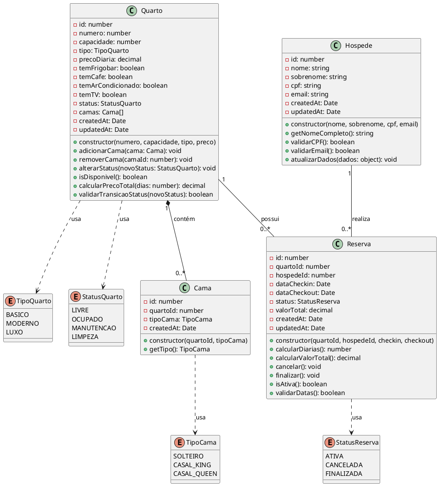

# Diagrama de Classes - Sistema de Reserva Hoteleira

## 1. Diagrama UML de Classes (PlantUML)



## 2. Diagrama de Classes Detalhado (Texto ASCII)

```
┌─────────────────────────────────────────────────────────────────────┐
│                           <<enumeration>>                            │
│                            TipoQuarto                                │
├─────────────────────────────────────────────────────────────────────┤
│ + BASICO                                                             │
│ + MODERNO                                                            │
│ + LUXO                                                               │
└─────────────────────────────────────────────────────────────────────┘

┌─────────────────────────────────────────────────────────────────────┐
│                           <<enumeration>>                            │
│                           StatusQuarto                               │
├─────────────────────────────────────────────────────────────────────┤
│ + LIVRE                                                              │
│ + OCUPADO                                                            │
│ + MANUTENCAO                                                         │
│ + LIMPEZA                                                            │
└─────────────────────────────────────────────────────────────────────┘

┌─────────────────────────────────────────────────────────────────────┐
│                           <<enumeration>>                            │
│                             TipoCama                                 │
├─────────────────────────────────────────────────────────────────────┤
│ + SOLTEIRO                                                           │
│ + CASAL_KING                                                         │
│ + CASAL_QUEEN                                                        │
└─────────────────────────────────────────────────────────────────────┘

┌─────────────────────────────────────────────────────────────────────┐
│                           <<enumeration>>                            │
│                          StatusReserva                               │
├─────────────────────────────────────────────────────────────────────┤
│ + ATIVA                                                              │
│ + CANCELADA                                                          │
│ + FINALIZADA                                                         │
└─────────────────────────────────────────────────────────────────────┘


┌─────────────────────────────────────────────────────────────────────┐
│                              Quarto                                  │
├─────────────────────────────────────────────────────────────────────┤
│ - id: number                                                         │
│ - numero: number                                    [UNIQUE]         │
│ - capacidade: number                                                 │
│ - tipo: TipoQuarto                                                   │
│ - precoDiaria: decimal                                               │
│ - temFrigobar: boolean                                               │
│ - temCafe: boolean                                                   │
│ - temArCondicionado: boolean                                         │
│ - temTV: boolean                                                     │
│ - status: StatusQuarto                              [DEFAULT: LIVRE] │
│ - camas: Cama[]                                                      │
│ - createdAt: Date                                                    │
│ - updatedAt: Date                                                    │
├─────────────────────────────────────────────────────────────────────┤
│ + constructor(numero, capacidade, tipo, preco)                       │
│ + adicionarCama(cama: Cama): void                                    │
│ + removerCama(camaId: number): void                                  │
│ + alterarStatus(novoStatus: StatusQuarto): void                      │
│ + isDisponivel(): boolean                                            │
│ + calcularPrecoTotal(dias: number): decimal                          │
│ + validarTransicaoStatus(novoStatus: StatusQuarto): boolean          │
│ + getCamas(): Cama[]                                                 │
│ + getNumero(): number                                                │
│ + getTipo(): TipoQuarto                                              │
│ + getStatus(): StatusQuarto                                          │
└─────────────────────────────────────────────────────────────────────┘
                              │
                              │ 1
                              │
                              │ contém
                              │
                              │ 0..*
                              ▼
┌─────────────────────────────────────────────────────────────────────┐
│                               Cama                                   │
├─────────────────────────────────────────────────────────────────────┤
│ - id: number                                                         │
│ - quartoId: number                                      [FK]         │
│ - tipoCama: TipoCama                                                 │
│ - createdAt: Date                                                    │
├─────────────────────────────────────────────────────────────────────┤
│ + constructor(quartoId, tipoCama)                                    │
│ + getTipo(): TipoCama                                                │
│ + getQuartoId(): number                                              │
└─────────────────────────────────────────────────────────────────────┘


┌─────────────────────────────────────────────────────────────────────┐
│                             Hospede                                  │
├─────────────────────────────────────────────────────────────────────┤
│ - id: number                                                         │
│ - nome: string                                      [NOT NULL]       │
│ - sobrenome: string                                 [NOT NULL]       │
│ - cpf: string                                       [UNIQUE]         │
│ - email: string                                     [NOT NULL]       │
│ - createdAt: Date                                                    │
│ - updatedAt: Date                                                    │
├─────────────────────────────────────────────────────────────────────┤
│ + constructor(nome, sobrenome, cpf, email)                           │
│ + getNomeCompleto(): string                                          │
│ + validarCPF(): boolean                                              │
│ + validarEmail(): boolean                                            │
│ + atualizarDados(dados: object): void                                │
│ + getCPF(): string                                                   │
│ + getEmail(): string                                                 │
└─────────────────────────────────────────────────────────────────────┘


┌─────────────────────────────────────────────────────────────────────┐
│                             Reserva                                  │
├─────────────────────────────────────────────────────────────────────┤
│ - id: number                                                         │
│ - quartoId: number                                      [FK]         │
│ - hospedeId: number                                     [FK]         │
│ - dataCheckin: Date                                     [NOT NULL]   │
│ - dataCheckout: Date                                    [NOT NULL]   │
│ - status: StatusReserva                         [DEFAULT: ATIVA]    │
│ - valorTotal: decimal                                                │
│ - createdAt: Date                                                    │
│ - updatedAt: Date                                                    │
├─────────────────────────────────────────────────────────────────────┤
│ + constructor(quartoId, hospedeId, checkin, checkout)                │
│ + calcularDiarias(): number                                          │
│ + calcularValorTotal(): decimal                                      │
│ + cancelar(): void                                                   │
│ + finalizar(): void                                                  │
│ + isAtiva(): boolean                                                 │
│ + validarDatas(): boolean                                            │
│ + getQuarto(): Quarto                                                │
│ + getHospede(): Hospede                                              │
│ + getStatus(): StatusReserva                                         │
└─────────────────────────────────────────────────────────────────────┘


RELACIONAMENTOS:

Quarto "1" ────────────── "0..*" Cama
       (um quarto contém zero ou mais camas)

Quarto "1" ────────────── "0..*" Reserva
       (um quarto possui zero ou mais reservas)

Hospede "1" ────────────── "0..*" Reserva
        (um hóspede realiza zero ou mais reservas)

```

## 3. Diagrama de Relacionamentos (ER Style)

```
                    ┌──────────────┐
                    │   TipoQuarto │
                    │  (Enum)      │
                    │ • BASICO     │
                    │ • MODERNO    │
                    │ • LUXO       │
                    └──────┬───────┘
                           │ usa
                           │
    ┌──────────────┐       │       ┌──────────────┐
    │ StatusQuarto │       │       │   TipoCama   │
    │   (Enum)     │       │       │   (Enum)     │
    │ • LIVRE      │       │       │ • SOLTEIRO   │
    │ • OCUPADO    │       │       │ • CASAL_KING │
    │ • MANUTENCAO │       │       │ • CASAL_QUEEN│
    │ • LIMPEZA    │       │       └──────┬───────┘
    └──────┬───────┘       │              │ usa
           │ usa           │              │
           │               │              │
           │        ┌──────▼──────┐       │
           └────────►    Quarto   ◄───────┘
                    │             │
                    │ PK: id      │
                    │ UK: numero  │
                    └──────┬──────┘
                           │
                           │ 1
                           │
              ┌────────────┼────────────┐
              │            │            │
              │ 0..*       │            │ 0..*
              │            │            │
       ┌──────▼──────┐     │     ┌──────▼──────┐
       │    Cama     │     │     │   Reserva   │
       │             │     │     │             │
       │ PK: id      │     │     │ PK: id      │
       │ FK: quartoId│     │     │ FK: quartoId│
       └─────────────┘     │     │ FK: hospedeId
                           │     └──────┬──────┘
                           │            │
                           │            │ 0..*
                           │            │
                           │            │ 1
                           │            │
                           │     ┌──────▼──────┐
                           │     │   Hospede   │
                           │     │             │
                           │     │ PK: id      │
                           │     │ UK: cpf     │
                           │     └─────────────┘
                           │
                           │
                    ┌──────▼──────┐
                    │StatusReserva│
                    │   (Enum)    │
                    │ • ATIVA     │
                    │ • CANCELADA │
                    │ • FINALIZADA│
                    └─────────────┘

```

## 4. Implementação TypeScript (Exemplo)

```typescript
// Enums
enum TipoQuarto {
  BASICO = 'BASICO',
  MODERNO = 'MODERNO',
  LUXO = 'LUXO'
}

enum StatusQuarto {
  LIVRE = 'LIVRE',
  OCUPADO = 'OCUPADO',
  MANUTENCAO = 'MANUTENCAO',
  LIMPEZA = 'LIMPEZA'
}

enum TipoCama {
  SOLTEIRO = 'SOLTEIRO',
  CASAL_KING = 'CASAL_KING',
  CASAL_QUEEN = 'CASAL_QUEEN'
}

enum StatusReserva {
  ATIVA = 'ATIVA',
  CANCELADA = 'CANCELADA',
  FINALIZADA = 'FINALIZADA'
}

// Classe Quarto
class Quarto {
  private id: number;
  private numero: number;
  private capacidade: number;
  private tipo: TipoQuarto;
  private precoDiaria: number;
  private temFrigobar: boolean;
  private temCafe: boolean;
  private temArCondicionado: boolean;
  private temTV: boolean;
  private status: StatusQuarto;
  private camas: Cama[];
  private createdAt: Date;
  private updatedAt: Date;

  constructor(numero: number, capacidade: number, tipo: TipoQuarto, preco: number) {
    this.numero = numero;
    this.capacidade = capacidade;
    this.tipo = tipo;
    this.precoDiaria = preco;
    this.status = StatusQuarto.LIVRE;
    this.camas = [];
    this.createdAt = new Date();
    this.updatedAt = new Date();
  }

  adicionarCama(cama: Cama): void {
    this.camas.push(cama);
  }

  alterarStatus(novoStatus: StatusQuarto): void {
    if (this.validarTransicaoStatus(novoStatus)) {
      this.status = novoStatus;
      this.updatedAt = new Date();
    }
  }

  isDisponivel(): boolean {
    return this.status === StatusQuarto.LIVRE;
  }

  validarTransicaoStatus(novoStatus: StatusQuarto): boolean {
    // Lógica de validação de transição
    return true;
  }

  calcularPrecoTotal(dias: number): number {
    return this.precoDiaria * dias;
  }
}

// Classe Cama
class Cama {
  private id: number;
  private quartoId: number;
  private tipoCama: TipoCama;
  private createdAt: Date;

  constructor(quartoId: number, tipoCama: TipoCama) {
    this.quartoId = quartoId;
    this.tipoCama = tipoCama;
    this.createdAt = new Date();
  }

  getTipo(): TipoCama {
    return this.tipoCama;
  }
}

// Classe Hospede
class Hospede {
  private id: number;
  private nome: string;
  private sobrenome: string;
  private cpf: string;
  private email: string;
  private createdAt: Date;
  private updatedAt: Date;

  constructor(nome: string, sobrenome: string, cpf: string, email: string) {
    this.nome = nome;
    this.sobrenome = sobrenome;
    this.cpf = cpf;
    this.email = email;
    this.createdAt = new Date();
    this.updatedAt = new Date();
  }

  getNomeCompleto(): string {
    return `${this.nome} ${this.sobrenome}`;
  }

  validarCPF(): boolean {
    // Lógica de validação de CPF
    return true;
  }

  validarEmail(): boolean {
    const regex = /^[^\s@]+@[^\s@]+\.[^\s@]+$/;
    return regex.test(this.email);
  }
}

// Classe Reserva
class Reserva {
  private id: number;
  private quartoId: number;
  private hospedeId: number;
  private dataCheckin: Date;
  private dataCheckout: Date;
  private status: StatusReserva;
  private valorTotal: number;
  private createdAt: Date;
  private updatedAt: Date;

  constructor(quartoId: number, hospedeId: number, checkin: Date, checkout: Date) {
    this.quartoId = quartoId;
    this.hospedeId = hospedeId;
    this.dataCheckin = checkin;
    this.dataCheckout = checkout;
    this.status = StatusReserva.ATIVA;
    this.createdAt = new Date();
    this.updatedAt = new Date();
  }

  calcularDiarias(): number {
    const diff = this.dataCheckout.getTime() - this.dataCheckin.getTime();
    return Math.ceil(diff / (1000 * 60 * 60 * 24));
  }

  cancelar(): void {
    this.status = StatusReserva.CANCELADA;
    this.updatedAt = new Date();
  }

  finalizar(): void {
    this.status = StatusReserva.FINALIZADA;
    this.updatedAt = new Date();
  }

  isAtiva(): boolean {
    return this.status === StatusReserva.ATIVA;
  }

  validarDatas(): boolean {
    return this.dataCheckout > this.dataCheckin;
  }
}

```

## 5. Cardinalidades e Restrições

| Relacionamento | Cardinalidade | Restrições |
|----------------|---------------|------------|
| Quarto → Cama | 1:N | Um quarto pode ter múltiplas camas |
| Quarto → Reserva | 1:N | Um quarto pode ter múltiplas reservas (histórico) |
| Hospede → Reserva | 1:N | Um hóspede pode fazer múltiplas reservas |
| Reserva → Quarto | N:1 | Uma reserva pertence a um único quarto |
| Reserva → Hospede | N:1 | Uma reserva pertence a um único hóspede |

**Regras de Negócio:**
* Quarto.numero deve ser único
* Hospede.cpf deve ser único
* Apenas quartos com status LIVRE podem receber novas reservas
* Reserva.dataCheckout deve ser maior que dataCheckin
* Ao criar reserva, Quarto.status muda para OCUPADO
* Ao cancelar reserva, Quarto.status volta para LIVRE
